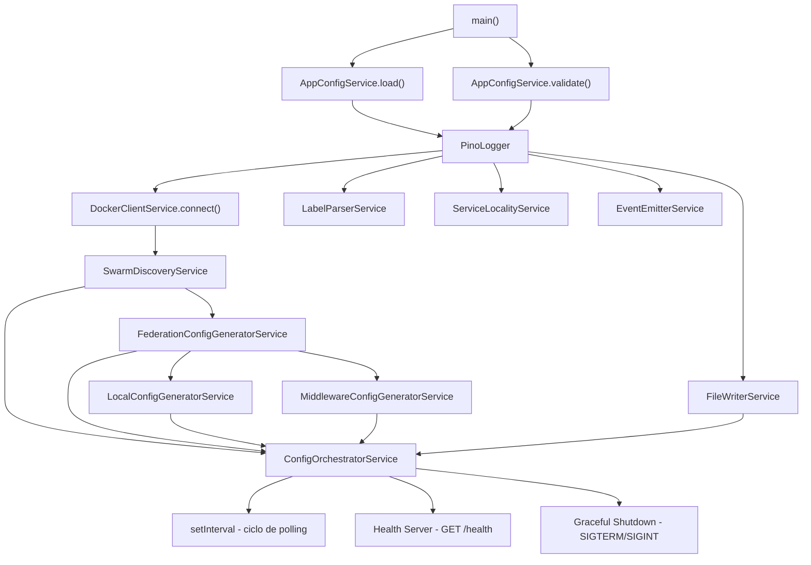
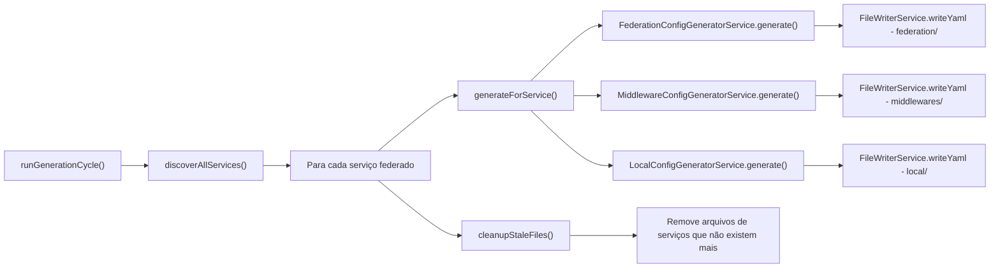

# 🏗️ Sidecar Traefik Federation — Documento de Arquitetura

> **Versão:** 2.0.0 (alinhada com a implementação real)
> **Propósito:** Sidecar que gera configuração dinâmica do Traefik para federação multi-nó em Docker Swarm

---

## Índice

1. [Diagrama de Arquitetura](#1-diagrama-de-arquitetura)
2. [Estrutura de Pastas](#2-estrutura-de-pastas)
3. [Type Definitions](#3-type-definitions)
4. [Core Interfaces](#4-core-interfaces)
5. [Bootstrap e Injeção de Dependência](#5-bootstrap-e-injeção-de-dependência)
6. [Data Flow](#6-data-flow)
7. [Geração de Configuração](#7-geração-de-configuração)
8. [Error Handling](#8-error-handling)
9. [Logging](#9-logging)
10. [Configuration Model](#10-configuration-model)
11. [Testing Strategy](#11-testing-strategy)
12. [Dependências npm](#12-dependências-npm)

---

## 1. Diagrama de Arquitetura

```
┌─────────────────────────────────────────────────────────────────────────────┐
│                            DOCKER SWARM CLUSTER                            │
│                                                                             │
│  ┌──────────────┐    ┌──────────────┐    ┌──────────────┐                  │
│  │   Node 1     │    │   Node 2     │    │   Node 3     │                  │
│  │  (Manager)   │    │  (Worker)    │    │  (Worker)    │                  │
│  │              │    │              │    │              │                  │
│  │ ┌──────────┐ │    │ ┌──────────┐ │    │ ┌──────────┐ │                  │
│  │ │ Traefik  │ │    │ │ Traefik  │ │    │ │ Traefik  │ │                  │
│  │ │ (Global) │ │    │ │ (Global) │ │    │ │ (Global) │ │                  │
│  │ └────┬─────┘ │    │ └────┬─────┘ │    │ └────┬─────┘ │                  │
│  │      │       │    │      │       │    │      │       │                  │
│  │ ┌────▼─────┐ │    │ ┌────▼─────┐ │    │ ┌────▼─────┐ │                  │
│  │ │ Sidecar  │ │    │ │ Sidecar  │ │    │ │ Sidecar  │ │                  │
│  │ │ (gnt)    │ │    │ │ (gnt)    │ │    │ │ (gnt)    │ │                  │
│  │ └────┬─────┘ │    │ └────┬─────┘ │    │ └────┬─────┘ │                  │
│  │      │       │    │      │       │    │      │       │                  │
│  │ ┌────▼─────┐ │    │ ┌────▼─────┐ │    │ ┌────▼─────┐ │                  │
│  │ │Syncthing │◄├────┼─┤Syncthing │◄├────┼─┤Syncthing │ │                  │
│  │ └──────────┘ │    │ └──────────┘ │    │ └──────────┘ │                  │
│  └──────────────┘    └──────────────┘    └──────────────┘                  │
│         ▲                    ▲                    ▲                         │
│         │                    │                    │                         │
│         │         ┌──────────┴──────────┐        │                         │
│         │         │  Volume Compartilhado │        │                         │
│         │         │  (Syncthing)         │        │                         │
│         │         │  /data/shared/      │        │                         │
│         │         └─────────────────────┘        │                         │
│         │                                        │                         │
│         └──────────────────┬─────────────────────┘                         │
│                            │                                                │
│               ┌────────────▼────────────┐                                   │
│               │  External Request       │                                   │
│               │  → Global Router        │                                   │
│               │  → Federated Service    │                                   │
│               │  → Remote Traefik       │                                   │
│               │  → Local Router         │                                   │
│               │  → Local Container      │                                   │
│               └─────────────────────────┘                                   │
└─────────────────────────────────────────────────────────────────────────────┘
```

### Fluxo de Requisição

```
External Request
    │
    ▼
┌─────────────────────────────────────────────────────┐
│ 1. DNS resolve para qualquer nó do cluster          │
└─────────────────────┬───────────────────────────────┘
                      │
                      ▼
┌─────────────────────────────────────────────────────┐
│ 2. Traefik Local (entrypoint web/websecure)          │
│    - Router federado match domínio                   │
│    - Encaminha para serviço federado                 │
└─────────────────────┬───────────────────────────────┘
                      │
                      ▼
┌─────────────────────────────────────────────────────┐
│ 3. Load Balancer do serviço federado                │
│    - Servidores = IPs de todos os nós com o serviço │
│    - Pesos: local=10, remoto=1                      │
│    - Sticky session (se ativo)                      │
│    - Circuit breaker (se ativo)                     │
│    - Retry (se ativo)                               │
└─────────────────────┬───────────────────────────────┘
                      │
                      ▼
┌─────────────────────────────────────────────────────┐
│ 4. Traefik Remoto (nó de destino)                   │
│    - Router local match domínio + X-Federated       │
│    - Encaminha para serviço local real              │
└─────────────────────┬───────────────────────────────┘
                      │
                      ▼
┌─────────────────────────────────────────────────────┐
│ 5. Container local do serviço                       │
└─────────────────────────────────────────────────────┘
```

---

## 2. Estrutura de Pastas

```
src/
├── index.ts                          # Bootstrap manual DI + entrypoint
│
├── config/
│   └── index.ts                      # AppConfigService: load + validação de env vars
│
├── core/
│   └── interfaces/
│       ├── index.ts                  # Barrel export
│       ├── IConfig.ts                # Interface de configuração
│       ├── IConfigGenerator.ts       # Interface de geração (não implementada atualmente)
│       ├── IDockerClient.ts          # Abstração da API Docker
│       ├── IEventEmitter.ts          # Eventos internos
│       ├── IFederationStrategy.ts    # Estratégia de federação
│       ├── IFileWriter.ts            # Escrita de arquivos
│       ├── ILabelParser.ts           # Parsing de labels
│       ├── ILogger.ts                # Logging
│       ├── IMiddlewareGenerator.ts   # Geração de middlewares
│       ├── IServiceLocality.ts       # Localidade de serviço
│       └── ISwarmDiscovery.ts        # Descoberta de serviços
│
├── docker/
│   └── DockerClient.ts               # DockerClientService: Dockerode wrapper
│
├── filesystem/
│   └── FileWriterService.ts          # Escrita atômica YAML com tmp+rename
│
├── generators/
│   ├── FederationConfigGeneratorService.ts   # Geração de config de federação
│   ├── LocalConfigGeneratorService.ts         # Geração de config local (Docker DNS)
│   └── MiddlewareConfigGeneratorService.ts    # Geração de middlewares
│
├── logger/
│   └── index.ts                      # PinoLogger implementation
│
├── services/
│   ├── ConfigOrchestratorService.ts   # Orquestrador principal do ciclo de geração
│   ├── EventEmitterService.ts         # Event emitter interno
│   ├── LabelParserService.ts          # Parse de labels federation.*
│   ├── ServiceLocalityService.ts      # Detecção de localidade (nó atual vs remoto)
│   └── SwarmDiscoveryService.ts       # Descoberta de serviços Swarm
│
├── types/
│   ├── index.ts                      # Barrel export
│   ├── config.ts                     # AppConfig, LabelConfig, EnvVars
│   ├── docker.ts                     # SwarmNode, SwarmTask, SwarmService, etc.
│   ├── errors.ts                     # Hierarquia de erros (SidecarError + subclasses)
│   └── federation.ts                 # ServerDefinition, LoadBalancerConfig, outputs
│
└── utils/
    ├── index.ts                      # Barrel export
    └── retry.ts                      # retryWithBackoff: exponential backoff genérico

src/__tests__/                         # Testes unitários (Vitest)
├── AppConfigService.test.ts           # ~20 testes: defaults, env vars, validação
├── ConfigOrchestrator.test.ts         # ~17 testes: ciclo, cleanup, erros
├── DockerClient.test.ts               # ~18 testes: connect, retry, mapeamento
├── FederationGenerator.test.ts        # ~20 testes: todas as opções combinadas
├── FileWriterService.test.ts          # ~17 testes: atomicidade, skip, erros
├── LabelParserService.test.ts         # ~14 testes: incluindo valores de borda
├── LocalGenerator.test.ts             # ~20 testes: local/remoto, health check
├── MiddlewareGenerator.test.ts        # ~13 testes: retry, circuit breaker
├── ServiceLocalityService.test.ts     # ~16 testes: pesos, fallback de porta
├── SwarmDiscoveryService.test.ts      # ~11 testes: descoberta, erros de nodo
└── types.test.ts                      # ~15 testes: erros, interfaces de output
```

---

## 3. Type Definitions

### [`src/types/docker.ts`](src/types/docker.ts)

```typescript
export interface SwarmNode {
    id: string;
    hostname: string;
    addr: string;
    role: string;
    availability: string;
    state: string;
    labels: Record<string, string>;
}

export interface SwarmTask {
    id: string;
    serviceId: string;
    nodeId: string;
    state: string;
    image: string;
    slot?: number;
}

export interface SwarmService {
    id: string;
    name: string;
    image: string;
    replicas: number;
    ports: Array<{ published: number; target: number }>;
    labels: Record<string, string>;
    updatedAt?: string;
}

export interface ServiceEndpoint {
    nodeId: string;
    hostname: string;
    addr: string;
    port: number;
}

export interface DiscoveredService {
    name: string;
    image: string;
    labels: Record<string, string>;
    endpoints: ServiceEndpoint[];
}
```

### [`src/types/config.ts`](src/types/config.ts)

```typescript
export interface AppConfig {
    node: {
        nodeId: string;
    };
    docker: {
        socketPath: string;
        connectionRetryAttempts: number;
        connectionRetryBaseDelayMs: number;
        connectionRetryMaxDelayMs: number;
    };
    directories: {
        federation: string;
        local: string;
        middlewares: string;
    };
    federation: {
        labelPrefix: string;
        localWeight: number;
        remoteWeight: number;
        healthCheckPath: string;
        healthCheckInterval: string;
        retryAttempts: number;
        retryInterval: string;
        circuitBreakerThreshold: number;
        stickySessionCookieName: string;
    };
    server: {
        port: number;
        host: string;
        pollIntervalMs: number;
    };
    logging: {
        level: string;
        prettyPrint: boolean;
    };
}

export interface LabelConfig {
    enabled: boolean;
    host: string;
    port: number;
    sticky?: boolean;
    retryAttempts?: number;
    retryInterval?: string;
    circuitBreaker?: boolean;
    healthCheckPath?: string;
    healthCheckInterval?: string;
    localityAware?: boolean;
}

export interface EnvVars {
    NODE_ID?: string;
    DOCKER_SOCKET?: string;
    DOCKER_CONNECTION_RETRY_ATTEMPTS?: string;
    DOCKER_CONNECTION_RETRY_BASE_DELAY_MS?: string;
    DOCKER_CONNECTION_RETRY_MAX_DELAY_MS?: string;
    FEDERATION_OUTPUT_DIR?: string;
    LOCAL_OUTPUT_DIR?: string;
    MIDDLEWARE_OUTPUT_DIR?: string;
    FEDERATION_LABEL_PREFIX?: string;
    FEDERATION_LOCAL_WEIGHT?: string;
    FEDERATION_REMOTE_WEIGHT?: string;
    FEDERATION_HEALTH_CHECK_PATH?: string;
    FEDERATION_HEALTH_CHECK_INTERVAL?: string;
    FEDERATION_RETRY_ATTEMPTS?: string;
    FEDERATION_RETRY_INTERVAL?: string;
    FEDERATION_CIRCUIT_BREAKER_THRESHOLD?: string;
    FEDERATION_STICKY_SESSION_COOKIE_NAME?: string;
    SERVER_PORT?: string;
    SERVER_HOST?: string;
    SERVER_POLL_INTERVAL_MS?: string;
    LOG_LEVEL?: string;
    LOG_PRETTY_PRINT?: string;
}
```

### [`src/types/federation.ts`](src/types/federation.ts)

```typescript
export interface ServerDefinition {
    url: string;
    weight?: number;
}

export interface RetryConfig {
    attempts: number;
    initialInterval: string;
}

export interface CircuitBreakerConfig {
    expression: string;
}

export interface HealthCheckConfig {
    path: string;
    interval: string;
}

export interface StickyConfig {
    cookie: {
        name: string;
        httpOnly?: boolean;
    };
}

export interface LoadBalancerConfig {
    passHostHeader: boolean;
    servers: ServerDefinition[];
    healthCheck?: HealthCheckConfig;
    sticky?: StickyConfig;
}

export interface ServiceOutput {
    loadBalancer: LoadBalancerConfig;
}

export interface RouterOutput {
    rule: string;
    entrypoints?: string[];
    middlewares?: string[];
    service: string;
    priority?: number;
}

export interface MiddlewareOutput {
    retry?: RetryConfig;
    circuitBreaker?: CircuitBreakerConfig;
    headers?: { customRequestHeaders: Record<string, string> };
}

export interface FederationConfigOutput {
    http: {
        services: Record<string, ServiceOutput>;
        routers?: Record<string, RouterOutput>;
    };
}

export interface LocalConfigOutput {
    http: {
        services: Record<string, ServiceOutput>;
        routers: Record<string, RouterOutput>;
    };
}

export interface MiddlewareConfigOutput {
    http: {
        middlewares: Record<string, MiddlewareOutput>;
    };
}

export type GenerationResult = {
    federation: FederationConfigOutput | null;
    local: LocalConfigOutput | null;
    middlewares: MiddlewareConfigOutput | null;
};
```

### [`src/types/errors.ts`](src/types/errors.ts)

```typescript
export class SidecarError extends Error {
    constructor(message: string, public readonly cause?: Error) { ... }
}

export class DockerConnectionError extends SidecarError { ... }
export class ConfigValidationError extends SidecarError { ... }
export class FileWriteError extends SidecarError {
    constructor(message: string, public readonly filePath: string, cause?: Error) { ... }
}
export class DiscoveryError extends SidecarError { ... }
```

---

## 4. Core Interfaces

Todas as interfaces estão em [`src/core/interfaces/`](src/core/interfaces/) e são a espinha dorsal da arquitetura.

| Interface | Propósito | Implementação |
|---|---|---|
| [`IConfig`](src/core/interfaces/IConfig.ts) | Carregamento e validação de config | [`AppConfigService`](src/config/index.ts) |
| [`IDockerClient`](src/core/interfaces/IDockerClient.ts) | Comunicação com API Docker | [`DockerClientService`](src/docker/DockerClient.ts) |
| [`ISwarmDiscovery`](src/core/interfaces/ISwarmDiscovery.ts) | Descoberta de serviços Swarm | [`SwarmDiscoveryService`](src/services/SwarmDiscoveryService.ts) |
| [`ILabelParser`](src/core/interfaces/ILabelParser.ts) | Parse de labels `federation.*` | [`LabelParserService`](src/services/LabelParserService.ts) |
| [`IFederationStrategy`](src/core/interfaces/IFederationStrategy.ts) | Estratégia de geração de config | [`FederationConfigGeneratorService`](src/generators/FederationConfigGeneratorService.ts) |
| [`IMiddlewareGenerator`](src/core/interfaces/IMiddlewareGenerator.ts) | Geração de middlewares | [`MiddlewareConfigGeneratorService`](src/generators/MiddlewareConfigGeneratorService.ts) |
| [`IFileWriter`](src/core/interfaces/IFileWriter.ts) | Escrita atômica de arquivos | [`FileWriterService`](src/filesystem/FileWriterService.ts) |
| [`IServiceLocality`](src/core/interfaces/IServiceLocality.ts) | Detecção de localidade | [`ServiceLocalityService`](src/services/ServiceLocalityService.ts) |
| [`IEventEmitter`](src/core/interfaces/IEventEmitter.ts) | Event emitter interno | [`EventEmitterService`](src/services/EventEmitterService.ts) |
| [`ILogger`](src/core/interfaces/ILogger.ts) | Logging estruturado | [`PinoLogger`](src/logger/index.ts) |
| [`IConfigGenerator`](src/core/interfaces/IConfigGenerator.ts) | (não implementada — interface órfã) | — |

---

## 5. Bootstrap e Injeção de Dependência

O sistema usa **injeção de dependência manual** (sem container) diretamente no [`src/index.ts`](src/index.ts). O bootstrap segue estas etapas:



As dependências são injetadas via construtor — cada classe recebe suas dependências como parâmetros tipados:

```typescript
// Exemplo do wiring em src/index.ts
const dockerClient = new DockerClientService(config, logger);
await dockerClient.connect();
const labelParser = new LabelParserService();
const fileWriter = new FileWriterService(config, logger);
const serviceLocality = new ServiceLocalityService(config);
const eventEmitter = new EventEmitterService();
const discovery = new SwarmDiscoveryService(dockerClient, labelParser, logger);
const federationGenerator = new FederationConfigGeneratorService(serviceLocality, labelParser, logger);
const localGenerator = new LocalConfigGeneratorService(serviceLocality, labelParser, config, logger);
const middlewareGenerator = new MiddlewareConfigGeneratorService(labelParser, logger);
const orchestrator = new ConfigOrchestratorService(
    discovery, federationGenerator, localGenerator,
    middlewareGenerator, fileWriter, config, logger
);
```

---

## 6. Data Flow

### Fluxo de Inicialização

```
main()
  │
  ├─► Carregar Config (AppConfigService.load)
  │     └─► process.env → AppConfig tipado com defaults
  │
  ├─► Validar Config (AppConfigService.validate)
  │     ├─► pollInterval >= 1000ms
  │     ├─► port 1-65535
  │     ├─► circuitBreakerThreshold 0-1
  │     ├─► retryAttempts >= 0
  │     └─► shared != local directories
  │
  ├─► Inicializar Logger (PinoLogger)
  │
  ├─► Conectar Docker Client (DockerClientService.connect)
  │     └─► Retry exponencial: 1s→2s→4s→8s→16s (5 tentativas)
  │
  ├─► Garantir Diretórios (ensureDirectories)
  │     └─► /data/shared/federation/
  │         /data/shared/middlewares/
  │         /data/local/generated/
  │
  ├─► Iniciar Servidor Health Check
  │     └─► GET /health → { status, uptime, version, services }
  │
  └─► Iniciar Ciclo de Polling
        └─► ConfigOrchestratorService.runGenerationCycle()
              └─► a cada pollIntervalMs
```

### Fluxo do Ciclo de Geração



### Etapas do `generateForService`:

1. **FederationConfigGenerator**: Gera [`FederationConfigOutput`](src/types/federation.ts:54) com:
   - Servidores ponderados (local weight=10, remote weight=1)
   - Health check (se configurado)
   - Sticky session (se `federation.sticky=true`)
   - Circuit breaker (se `federation.circuitBreaker=true`, expression hardcoded)

2. **MiddlewareConfigGenerator**: Gera [`MiddlewareConfigOutput`](src/types/federation.ts:67) com:
   - Retry middleware (se `retryAttempts > 0`)
   - Circuit breaker middleware (se `circuitBreaker=true`)

3. **LocalConfigGenerator**: Gera [`LocalConfigOutput`](src/types/federation.ts:60) com:
   - Service apontando para Docker DNS interno (`<serviceName>:<port>`)
   - Router com regra `Host + X-Federated header` (previne loop)
   - Middlewares de retry/circuit breaker (se configurados)

---

## 7. Geração de Configuração

### Arquivos Gerados

```
/data/
├── shared/                        # Sincronizado via Syncthing
│   ├── federation/
│   │   └── <service>.yaml         # Config de federação: servidores, LB, health check
│   └── middlewares/
│       └── <service>.yaml         # Middlewares: retry, circuit breaker
│
└── local/                         # NUNCA sincronizado
    └── generated/
        └── <service>.yaml         # Config local: router interno + Docker DNS
```

### Exemplo: Config de Federação Gerada

```yaml
http:
  services:
    meu-servico:
      loadBalancer:
        passHostHeader: true
        servers:
          - url: http://10.0.0.1:3000
            weight: 10
          - url: http://10.0.0.2:3000
            weight: 1
        healthCheck:
          path: /health
          interval: 10s
        sticky:
          cookie:
            name: meu-servico-session
            httpOnly: true
```

### Exemplo: Config Local Gerada

```yaml
http:
  services:
    meu-servico-local:
      loadBalancer:
        passHostHeader: true
        servers:
          - url: http://meu-servico:3000
  routers:
    meu-servico-local:
      rule: Host(`app.local`) && Headers(`X-Federated`, `true`)
      entrypoints:
        - web
      service: meu-servico-local
      middlewares:
        - meu-servico-retry
        - meu-servico-circuitbreaker
      priority: 200
```

### Exemplo: Middleware Gerado

```yaml
http:
  middlewares:
    meu-servico-retry:
      retry:
        attempts: 3
        initialInterval: 100ms
    meu-servico-circuitbreaker:
      circuitBreaker:
        expression: NetworkErrorRatio() > 0.30
```

---

## 8. Error Handling

### Hierarquia de Erros

```
SidecarError (base)
├── DockerConnectionError   ← falha de conexão com Docker (recoverable)
├── ConfigValidationError   ← configuração inválida (fatal)
├── FileWriteError          ← falha de IO (recoverable)
└── DiscoveryError          ← falha na descoberta (recoverable)
```

### Estratégia por Categoria

| Categoria | Exemplos | Ação |
|---|---|---|
| **Fatal** | Config inválida | Aborta startup, processo exit |
| **Recuperável (core)** | Docker desconectado | Reconexão automática com backoff |
| **Recuperável (ciclo)** | Falha em serviço individual | Log warn + skip, ciclo continua |
| **Recuperável (IO)** | Falha ao escrever arquivo | Log error, próximo ciclo tenta novamente |

### Tratamento no Ciclo de Geração

- Erros no `discoverAllServices()` são logados como `error`, ciclo abortado
- Erros no `generateForService()` para um serviço específico são logados como `warn`, serviço pulado
- Erros no `writeYaml()` lançam `FileWriteError` com o path do arquivo
- Erros no `cleanupStaleFiles()` são logados como `warn`, não interrompem o ciclo

### Reconexão Docker

```typescript
// DockerClientService.handleDisconnect()
// 1. Detecta desconexão
// 2. Tenta reconectar a cada 10s
// 3. Notifica callbacks registrados via onReconnect()
// 4. Loga cada tentativa
```

---

## 9. Logging

Implementado com **Pino** ([`PinoLogger`](src/logger/index.ts)), logger estruturado de alta performance.

### Níveis

| Nível | Uso |
|---|---|
| `debug` | Diagnóstico detalhado (pouco usado atualmente) |
| `info` | Operações normais: ciclos, escrita de arquivos |
| `warn` | Situações anormais recuperáveis: serviço sem labels, falha em discovery |
| `error` | Erros operacionais: falha de IO, Docker desconectado |
| `fatal` | Erro fatal de startup |

### Formato

Configurável via `LOG_LEVEL` e `LOG_PRETTY_PRINT`. Em produção, saída JSON (`pino`). Em dev, pretty-print com cores.

### Child Loggers

```typescript
logger.child({ context: 'ConfigOrchestrator' }).info('Ciclo iniciado');
// Saída: {"context":"ConfigOrchestrator","msg":"Ciclo iniciado",...}
```

---

## 10. Configuration Model

### Variáveis de Ambiente

| Variável | Default | Descrição |
|---|---|---|
| `NODE_ID` | — | ID do nó atual (obrigatório para locality) |
| `DOCKER_SOCKET` | `/var/run/docker.sock` | Caminho do socket Docker |
| `DOCKER_CONNECTION_RETRY_ATTEMPTS` | `5` | Tentativas de conexão inicial |
| `DOCKER_CONNECTION_RETRY_BASE_DELAY_MS` | `1000` | Delay inicial do backoff (ms) |
| `DOCKER_CONNECTION_RETRY_MAX_DELAY_MS` | `16000` | Delay máximo do backoff (ms) |
| `FEDERATION_OUTPUT_DIR` | `/data/shared/federation` | Diretório de saída federação |
| `LOCAL_OUTPUT_DIR` | `/data/local/generated` | Diretório de saída local |
| `MIDDLEWARE_OUTPUT_DIR` | `/data/shared/middlewares` | Diretório de saída middlewares |
| `FEDERATION_LABEL_PREFIX` | `federation` | Prefixo das labels |
| `FEDERATION_LOCAL_WEIGHT` | `10` | Peso do servidor local |
| `FEDERATION_REMOTE_WEIGHT` | `1` | Peso do servidor remoto |
| `FEDERATION_HEALTH_CHECK_PATH` | `/` | Path padrão do health check |
| `FEDERATION_HEALTH_CHECK_INTERVAL` | `10s` | Intervalo do health check |
| `FEDERATION_RETRY_ATTEMPTS` | `3` | Tentativas de retry |
| `FEDERATION_RETRY_INTERVAL` | `100ms` | Intervalo do retry |
| `FEDERATION_CIRCUIT_BREAKER_THRESHOLD` | `0.30` | Threshold do circuit breaker (⚠️ não aplicado) |
| `FEDERATION_STICKY_SESSION_COOKIE_NAME` | `auto` | Nome do cookie (gerado do service name) |
| `SERVER_PORT` | `9090` | Porta do health server |
| `SERVER_HOST` | `0.0.0.0` | Host do health server |
| `SERVER_POLL_INTERVAL_MS` | `10000` | Intervalo entre ciclos (ms) |
| `LOG_LEVEL` | `info` | Nível de log |
| `LOG_PRETTY_PRINT` | `false` | Pretty-print no log |

### Labels Docker (por serviço)

| Label | Obrigatório | Descrição |
|---|---|---|
| `federation.enable` | Sim | `true` para ativar federação |
| `federation.host` | Sim | Hostname virtual (ex: `app.local`) |
| `federation.port` | Sim | Porta do container |
| `federation.sticky` | Não | `true` para sticky sessions |
| `federation.retryAttempts` | Não | Número de tentativas de retry |
| `federation.retryInterval` | Não | Intervalo entre retries (ex: `200ms`) |
| `federation.circuitBreaker` | Não | `true` para ativar circuit breaker |
| `federation.healthCheckPath` | Não | Path do health check (default: `/`) |
| `federation.healthCheckInterval` | Não | Intervalo (default: `10s`) |
| `federation.localityAware` | Não | `true` para ativar locality-aware (default: true) |

---

## 11. Testing Strategy

### Framework

**Vitest** — 11 arquivos de teste, ~152 testes unitários.

### Organização

Testes unitários em [`src/__tests__/`](src/__tests__/), um arquivo por módulo. Sem testes de integração (requerem Docker Swarm real).

### Mocks

- **Dockerode**: Mock completo via `vi.mock('dockerode')`
- **File System**: Mock via `vi.mock('node:fs/promises')`
- **Services**: Mocks tipados implementando as interfaces do core

### Cobertura por Módulo

| Módulo | Testes | Cobertura |
|---|---|---|
| AppConfigService | ~20 | ✅ Defaults, env vars, validação de borda (NaN, 0, negativos) |
| ConfigOrchestrator | ~17 | ✅ Ciclo completo, cleanup, erros |
| DockerClient | ~18 | ✅ Connect, disconnect, retry, mapeamento, reconexão |
| FederationGenerator | ~20 | ✅ canHandle, todas as opções combinadas, weighted servers |
| FileWriterService | ~17 | ✅ Atomicidade, skip se inalterado, criação de diretórios, erros |
| LabelParserService | ~14 | ✅ Valores de borda (porta 0, 65536), defaults, null cases |
| LocalGenerator | ~20 | ✅ Local vs remoto, Docker DNS, router header, middlewares |
| MiddlewareGenerator | ~13 | ✅ Retry, circuit breaker, combinado, null cases |
| ServiceLocalityService | ~16 | ✅ isLocal, pesos, fallback de porta 80 |
| SwarmDiscoveryService | ~11 | ✅ Descoberta, filtro, erros de nodo, local services |
| Types | ~15 | ✅ Hierarquia de erros, interfaces de output |

### Testando um Serviço Federado (exemplo de mock)

```typescript
const mockService: DiscoveredService = {
    name: 'app',
    image: 'app:latest',
    labels: {
        'federation.enable': 'true',
        'federation.host': 'app.local',
        'federation.port': '3000',
    },
    endpoints: [
        { nodeId: 'node-1', hostname: 'node-1', addr: '10.0.0.1', port: 3000 },
    ],
};
```

---

## 12. Dependências npm

### Produção

| Pacote | Versão | Propósito |
|---|---|---|
| [`dockerode`](https://www.npmjs.com/package/dockerode) | `^4.0.0` | Cliente Docker API |
| [`js-yaml`](https://www.npmjs.com/package/js-yaml) | `^4.1.1` | Renderização YAML |
| [`pino`](https://www.npmjs.com/package/pino) | `^9.0.0` | Logger estruturado |
| [`pino-pretty`](https://www.npmjs.com/package/pino-pretty) | `^13.0.0` | Formatação de log em dev |

### Desenvolvimento

| Pacote | Versão | Propósito |
|---|---|---|
| [`typescript`](https://www.npmjs.com/package/typescript) | `^5.5.0` | Compilador TS |
| [`@types/node`](https://www.npmjs.com/package/@types/node) | `^22.0.0` | Types Node.js |
| [`@types/dockerode`](https://www.npmjs.com/package/@types/dockerode) | `^4.0.0` | Types Dockerode |
| [`@types/js-yaml`](https://www.npmjs.com/package/@types/js-yaml) | `^4.0.9` | Types js-yaml |
| [`tsx`](https://www.npmjs.com/package/tsx) | `^4.0.0` | TypeScript executor (dev) |
| [`vitest`](https://www.npmjs.com/package/vitest) | `^3.1.1` | Framework de testes |

---

> **Documento de Arquitetura v2.0.0** — Sidecar Traefik Federation  
> Atualizado em: 2026-05-08  
> Alinhado com a implementação real em [`src/`](src/)
