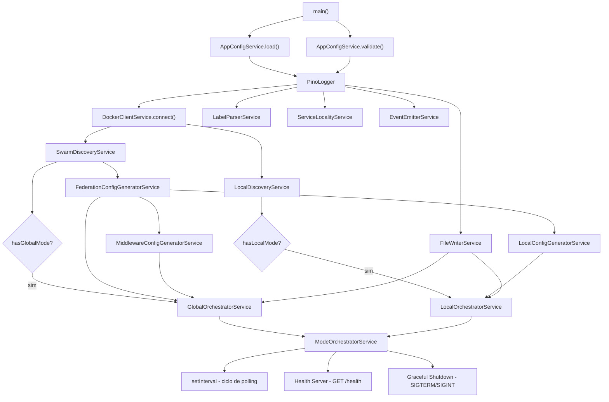
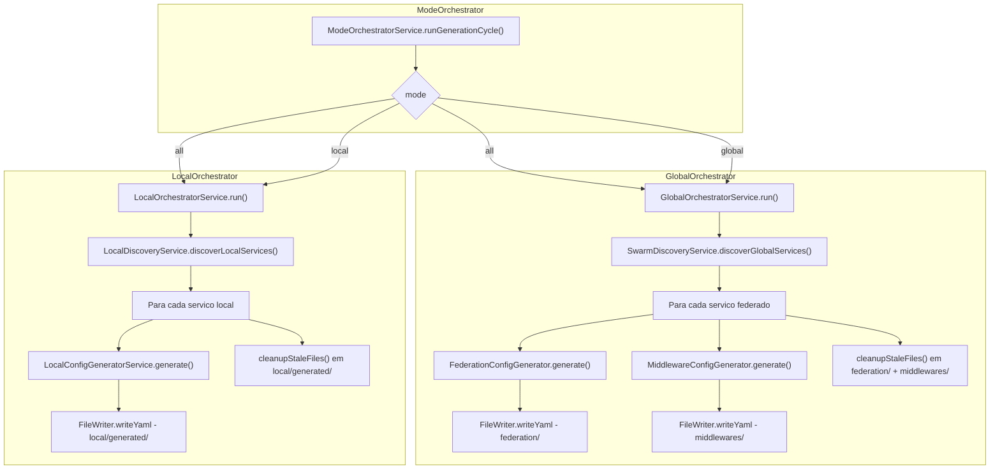

# 🏗️ Sidecar Traefik Federation — Documento de Arquitetura

> **Versão:** 2.1.0 (mode-aware — suporte a `GENERATION_MODE=all|global|local`)
> **Propósito:** Sidecar que gera configuração dinâmica do Traefik para federação multi-nó em Docker Swarm
> **Última atualização:** 2026-05-08

---

## Índice

1. [Diagrama de Arquitetura](#1-diagrama-de-arquitetura)
2. [Estrutura de Pastas](#2-estrutura-de-pastas)
3. [Type Definitions](#3-type-definitions)
4. [Core Interfaces](#4-core-interfaces)
5. [Bootstrap e Injeção de Dependência](#5-bootstrap-e-injeção-de-dependência)
6. [Data Flow](#6-data-flow)
7. [Geração de Configuração](#7-geração-de-configuração)
8. [Error Handling](#8-error-handling)
9. [Logging](#9-logging)
10. [Configuration Model](#10-configuration-model)
11. [Testing Strategy](#11-testing-strategy)
12. [Dependências npm](#12-dependências-npm)

---

## 1. Diagrama de Arquitetura

```
┌─────────────────────────────────────────────────────────────────────────────────┐
│                            DOCKER SWARM CLUSTER                                │
│                                                                                 │
│  ┌──────────────────────┐    ┌──────────────────────┐    ┌──────────────────┐  │
│  │   Node 1 (Manager)   │    │   Node 2 (Worker)    │    │   Node 3 (Worker)│  │
│  │   GENERATION_MODE    │    │   GENERATION_MODE    │    │   GENERATION_MODE│  │
│  │   = global           │    │   = local            │    │   = local        │  │
│  │                      │    │                      │    │                  │  │
│  │ ┌──────────────────┐ │    │ ┌──────────────────┐ │    │ ┌──────────────┐ │  │
│  │ │ SwarmDiscovery   │ │    │ │ LocalDiscovery   │ │    │ │LocalDiscovery│ │  │
│  │ │ Service          │ │    │ │ Service          │ │    │ │ Service      │ │  │
│  │ │ (API Swarm)      │ │    │ │ (listContainers) │ │    │ │(listContain) │ │  │
│  │ └───────┬──────────┘ │    │ └───────┬──────────┘ │    │ └──────┬───────┘ │  │
│  │         │            │    │         │            │    │         │         │  │
│  │ ┌───────▼──────────┐ │    │ ┌───────▼──────────┐ │    │ ┌───────▼───────┐ │  │
│  │ │ GlobalOrchestrator│ │    │ │ LocalOrchestrator│ │    │ │LocalOrchestra│ │  │
│  │ │ Federacao + Mw   │ │    │ │ Rotas node-spc   │ │    │ │Rotas node-spc│ │  │
│  │ └───────┬──────────┘ │    │ └───────┬──────────┘ │    │ └───────┬───────┘ │  │
│  │         │            │    │         │            │    │         │         │  │
│  │ ┌───────▼──────────┐ │    │ ┌───────▼──────────┐ │    │ ┌───────▼───────┐ │  │
│  │ │  /data/shared/   │ │    │ │  /data/local/    │ │    │ │  /data/local/ │ │  │
│  │ │  federacao       │ │    │ │  generated/      │ │    │ │  generated/   │ │  │
│  │ │  middlewares     │ │    │ │                  │ │    │ │               │ │  │
│  │ └────────┬─────────┘ │    │ └──────────────────┘ │    │ └───────────────┘ │  │
│  │          │           │    │                      │    │                   │  │
│  │ ┌────────▼─────────┐ │    │                      │    │                   │  │
│  │ │    Syncthing     │◄├────┼──────────────────────┼────┼───────────────────┘  │
│  │ └──────────────────┘ │    │                      │    │                      │
│  └──────────────────────┘    └──────────────────────┘    └──────────────────────┘
│         ▲                                                                      │
│         │                                                                      │
│         │         ┌─────────────────────────────┐                             │
│         │         │  Volume Compartilhado        │                             │
│         │         │  (Syncthing)                 │                             │
│         │         │  /data/shared/               │                             │
│         │         └─────────────────────────────┘                             │
│         │                                                                      │
│         └──────────────────┬──────────────────────────────────────────────────┘
│                            │
│               ┌────────────▼────────────────────┐
│               │  External Request Flow          │
│               │  1. DNS → qualquer nó           │
│               │  2. Traefik local → router fed  │
│               │  3. LB → servidores ponderados  │
│               │  4. Traefik remoto → container  │
│               └─────────────────────────────────┘
└─────────────────────────────────────────────────────────────────────────────────┘
```

### Fluxo de Requisição

```
External Request
    │
    ▼
┌─────────────────────────────────────────────────────┐
│ 1. DNS resolve para qualquer nó do cluster          │
└─────────────────────┬───────────────────────────────┘
                      │
                      ▼
┌─────────────────────────────────────────────────────┐
│ 2. Traefik Local (entrypoint web/websecure)          │
│    - Router federado match domínio                   │
│    - Encaminha para serviço federado                 │
└─────────────────────┬───────────────────────────────┘
                      │
                      ▼
┌─────────────────────────────────────────────────────┐
│ 3. Load Balancer do serviço federado                │
│    - Servidores = IPs de todos os nós com o serviço │
│    - Pesos: local=10, remoto=1                      │
│    - Sticky session (se ativo)                      │
│    - Circuit breaker (se ativo)                     │
│    - Retry (se ativo)                               │
└─────────────────────┬───────────────────────────────┘
                      │
                      ▼
┌─────────────────────────────────────────────────────┐
│ 4. Traefik Remoto (nó de destino)                   │
│    - Router local match domínio + X-Federated       │
│    - Encaminha para serviço local real              │
└─────────────────────┬───────────────────────────────┘
                      │
                      ▼
┌─────────────────────────────────────────────────────┐
│ 5. Container local do serviço                       │
└─────────────────────────────────────────────────────┘
```

---

## 2. Estrutura de Pastas

```
src/
├── index.ts                          # Bootstrap mode-aware DI + entrypoint
│
├── config/
│   └── index.ts                      # AppConfigService: load + validação de env vars (GENERATION_MODE)
│
├── core/
│   └── interfaces/
│       ├── index.ts                  # Barrel export
│       ├── IConfig.ts                # Interface de configuração
│       ├── IDockerClient.ts          # Abstração da API Docker
│       ├── IEventEmitter.ts          # Eventos internos
│       ├── IFederationStrategy.ts    # Estratégia de federação
│       ├── IFileWriter.ts            # Escrita de arquivos
│       ├── ILabelParser.ts           # Parsing de labels federation.*
│       ├── ILocalConfigGenerator.ts  # Geração de config local
│       ├── ILocalDiscoveryService.ts # NOVO - Descoberta local (não Swarm)
│       ├── ILogger.ts                # Logging
│       ├── IMiddlewareGenerator.ts   # Geração de middlewares
│       ├── IServiceLocality.ts       # Localidade de serviço
│       └── ISwarmDiscovery.ts        # Descoberta de serviços Swarm
│
├── docker/
│   └── DockerClient.ts               # DockerClientService: Dockerode wrapper
│
├── filesystem/
│   └── FileWriterService.ts          # Escrita atômica YAML com tmp+rename
│
├── generators/
│   ├── FederationConfigGeneratorService.ts   # Geração de config de federação
│   ├── LocalConfigGeneratorService.ts         # Geração de config local (Docker DNS)
│   └── MiddlewareConfigGeneratorService.ts    # Geração de middlewares
│
├── logger/
│   └── index.ts                      # PinoLogger implementation
│
├── orchestration/                    # NOVA!
│   ├── index.ts                      # Barrel export
│   ├── GlobalOrchestratorService.ts  # NOVO - Orquestrador de configs compartilhadas
│   ├── LocalOrchestratorService.ts   # NOVO - Orquestrador de configs node-specific
│   └── ModeOrchestratorService.ts    # NOVO - Fachada mode-aware (all/global/local)
│
├── services/
│   ├── ConfigOrchestratorService.ts   # NÃO usado no bootstrap (mantido p/ referência)
│   ├── EventEmitterService.ts         # Event emitter interno
│   ├── LabelParserService.ts          # Parse de labels federation.*
│   ├── LocalDiscoveryService.ts       # NOVO - Descoberta local via APIs Swarm
│   ├── ServiceLocalityService.ts      # Detecção de localidade
│   └── SwarmDiscoveryService.ts       # Descoberta de serviços Swarm (implementa ILocalDiscoveryService)
│
├── types/
│   ├── index.ts                      # Barrel export
│   ├── config.ts                     # AppConfig, LabelConfig, EnvVars + GenerationMode
│   ├── docker.ts                     # SwarmNode, SwarmTask, SwarmService, etc.
│   ├── errors.ts                     # Hierarquia de erros + InvalidModeError
│   └── federation.ts                 # ServerDefinition, LoadBalancerConfig, outputs
│
└── utils/
    ├── index.ts                      # Barrel export
    └── retry.ts                      # retryWithBackoff: exponential backoff genérico

src/__tests__/                         # Testes unitários (Vitest) - 14 arquivos
├── AppConfigService.test.ts           # ~26 testes: defaults + GENERATION_MODE
├── DockerClient.test.ts               # ~18 testes: connect, retry, mapeamento
├── FederationGenerator.test.ts        # ~20 testes: todas as opções combinadas
├── FileWriterService.test.ts          # ~17 testes: atomicidade, skip, erros
├── GlobalOrchestrator.test.ts         # NOVO - 8 testes: ciclo global, cleanup
├── LabelParserService.test.ts         # ~14 testes: incluindo valores de borda
├── LocalDiscoveryService.test.ts      # NOVO - 10 testes: descoberta local
├── LocalGenerator.test.ts             # ~20 testes: local/remoto, health check
├── LocalOrchestrator.test.ts          # NOVO - 8 testes: ciclo local, cleanup
├── MiddlewareGenerator.test.ts        # ~13 testes: retry, circuit breaker
├── ModeOrchestrator.test.ts           # NOVO - 8 testes: decisão de mode
├── ServiceLocalityService.test.ts     # ~16 testes: pesos, fallback de porta
├── SwarmDiscoveryService.test.ts      # ~9 testes: descoberta, erros de nodo
└── types.test.ts                      # ~15 testes: erros, interfaces de output
```

---

## 3. Type Definitions

### [`src/types/docker.ts`](src/types/docker.ts)

```typescript
export interface SwarmNode {
    id: string;
    hostname: string;
    ip: string;
    availability: string;
    status: string;
}

export interface SwarmTask {
    id: string;
    nodeId: string;
    serviceId: string;
    status: string;
    desiredState: string;
    slot: number;
}

export interface SwarmService {
    id: string;
    name: string;
    labels: Record<string, string>;
    ports?: Array<{ published: number; target: number }>;
    image: string;
    replicas: number;
}

export interface ServiceEndpoint {
    nodeId: string;
    nodeHostname: string;
    nodeIp: string;
    taskStatus: string;
    taskId: string;
}

export interface DiscoveredService {
    serviceName: string;
    serviceId: string;
    labels: Record<string, string>;
    endpoints: ServiceEndpoint[];
}
```

### [`src/types/config.ts`](src/types/config.ts)

```typescript
export type GenerationMode = 'all' | 'global' | 'local';

export interface AppConfig {
    mode: GenerationMode;
    node: {
        hostname: string;
        ip: string;
        nodeId: string;
    };
    docker: {
        socket: string;
        pollIntervalMs: number;
    };
    directories: {
        shared: string;
        local: string;
        federation: string;
        middlewares: string;
        localGenerated: string;
    };
    federation: {
        headerName: string;
        headerValue: string;
        defaultHealthCheckPath: string;
        defaultHealthCheckInterval: string;
        defaultRetryAttempts: number;
        defaultRetryInterval: string;
        circuitBreakerThreshold: number;
    };
    server: {
        port: number;
        healthEndpoint: string;
    };
    logging: {
        level: string;
        pretty: boolean;
    };
}

export interface LabelConfig {
    enabled: boolean;
    host: string;
    port: number;
    sticky?: boolean;
    retryAttempts?: number;
    retryInterval?: string;
    circuitBreaker?: boolean;
    healthCheckPath?: string;
    healthCheckInterval?: string;
    localityAware?: boolean;
}

export interface EnvVars {
    GENERATION_MODE?: string;
    NODE_HOSTNAME?: string;
    NODE_IP?: string;
    NODE_ID?: string;
    DOCKER_SOCKET?: string;
    POLL_INTERVAL_MS?: string;
    SHARED_DIR?: string;
    LOCAL_DIR?: string;
    SERVER_PORT?: string;
    HEALTH_ENDPOINT?: string;
    LOG_LEVEL?: string;
    LOG_PRETTY?: string;
    FEDERATION_HEADER_NAME?: string;
    FEDERATION_HEADER_VALUE?: string;
    CIRCUIT_BREAKER_THRESHOLD?: string;
    DEFAULT_RETRY_ATTEMPTS?: string;
    DEFAULT_RETRY_INTERVAL?: string;
}
```

### [`src/types/federation.ts`](src/types/federation.ts)

```typescript
export interface ServerDefinition {
    url: string;
    weight?: number;
}

export interface RetryConfig {
    attempts: number;
    initialInterval: string;
}

export interface CircuitBreakerConfig {
    expression: string;
}

export interface HealthCheckConfig {
    path: string;
    interval: string;
}

export interface StickyConfig {
    cookie: {
        name: string;
        httpOnly?: boolean;
    };
}

export interface LoadBalancerConfig {
    passHostHeader: boolean;
    servers: ServerDefinition[];
    healthCheck?: HealthCheckConfig;
    sticky?: StickyConfig;
}

export interface ServiceOutput {
    loadBalancer: LoadBalancerConfig;
}

export interface RouterOutput {
    rule: string;
    entrypoints?: string[];
    middlewares?: string[];
    service: string;
    priority?: number;
}

export interface MiddlewareOutput {
    retry?: RetryConfig;
    circuitBreaker?: CircuitBreakerConfig;
    headers?: { customRequestHeaders: Record<string, string> };
}

export interface FederationConfigOutput {
    http: {
        services: Record<string, ServiceOutput>;
        routers?: Record<string, RouterOutput>;
    };
}

export interface LocalConfigOutput {
    http: {
        services: Record<string, ServiceOutput>;
        routers: Record<string, RouterOutput>;
    };
}

export interface MiddlewareConfigOutput {
    http: {
        middlewares: Record<string, MiddlewareOutput>;
    };
}

export type GenerationResult = {
    federation: FederationConfigOutput | null;
    local: LocalConfigOutput | null;
    middlewares: MiddlewareConfigOutput | null;
};
```

### [`src/types/errors.ts`](src/types/errors.ts)

```typescript
export class SidecarError extends Error {
    constructor(message: string, public readonly cause?: Error) { ... }
}

export class DockerConnectionError extends SidecarError { ... }
export class ConfigValidationError extends SidecarError { ... }
export class FileWriteError extends SidecarError {
    constructor(message: string, public readonly filePath: string, cause?: Error) { ... }
}
export class DiscoveryError extends SidecarError { ... }
```

---

## 4. Core Interfaces

Todas as interfaces estão em [`src/core/interfaces/`](src/core/interfaces/) e são a espinha dorsal da arquitetura.

| Interface | Propósito | Implementação |
|---|---|---|
| [`IConfig`](src/core/interfaces/IConfig.ts) | Carregamento e validação de config | [`AppConfigService`](src/config/index.ts) |
| [`IDockerClient`](src/core/interfaces/IDockerClient.ts) | Comunicação com API Docker | [`DockerClientService`](src/docker/DockerClient.ts) |
| [`ISwarmDiscovery`](src/core/interfaces/ISwarmDiscovery.ts) | Descoberta de serviços Swarm (manager) | [`SwarmDiscoveryService`](src/services/SwarmDiscoveryService.ts) |
| [`ILocalDiscoveryService`](src/core/interfaces/ILocalDiscoveryService.ts) | Descoberta de containers locais (worker) | [`LocalDiscoveryService`](src/services/LocalDiscoveryService.ts) |
| [`ILabelParser`](src/core/interfaces/ILabelParser.ts) | Parse de labels `federation.*` | [`LabelParserService`](src/services/LabelParserService.ts) |
| [`IFederationStrategy`](src/core/interfaces/IFederationStrategy.ts) | Geração de config de federação | [`FederationConfigGeneratorService`](src/generators/FederationConfigGeneratorService.ts) |
| [`IMiddlewareGenerator`](src/core/interfaces/IMiddlewareGenerator.ts) | Geração de middlewares | [`MiddlewareConfigGeneratorService`](src/generators/MiddlewareConfigGeneratorService.ts) |
| [`ILocalConfigGenerator`](src/core/interfaces/ILocalConfigGenerator.ts) | Geração de config local (rotas node-specific) | [`LocalConfigGeneratorService`](src/generators/LocalConfigGeneratorService.ts) |
| [`IFileWriter`](src/core/interfaces/IFileWriter.ts) | Escrita atômica de arquivos | [`FileWriterService`](src/filesystem/FileWriterService.ts) |
| [`IServiceLocality`](src/core/interfaces/IServiceLocality.ts) | Detecção de localidade | [`ServiceLocalityService`](src/services/ServiceLocalityService.ts) |
| [`IEventEmitter`](src/core/interfaces/IEventEmitter.ts) | Event emitter interno | [`EventEmitterService`](src/services/EventEmitterService.ts) |
| [`ILogger`](src/core/interfaces/ILogger.ts) | Logging estruturado | [`PinoLogger`](src/logger/index.ts) |

---

## 5. Bootstrap e Injeção de Dependência

O sistema usa **injeção de dependência manual** (sem container) diretamente no [`src/index.ts`](src/index.ts). A arquitetura mode-aware bifurca o bootstrap conforme o `GENERATION_MODE`:



As dependências são injetadas via construtor. O bootstrap atual em [`src/index.ts`](src/index.ts) é mode-aware:

```typescript
// Bootstrap mode-aware (src/index.ts - simplificado)
const { mode } = config;
const hasGlobalMode = mode === 'all' || mode === 'global';
const hasLocalMode = mode === 'all' || mode === 'local';

const dockerClient = new DockerClientService(config, logger);
await dockerClient.connect();
const labelParser = new LabelParserService();
const fileWriter = new FileWriterService(config, logger);
const serviceLocality = new ServiceLocalityService(config);
const eventEmitter = new EventEmitterService();

let globalOrchestrator: GlobalOrchestratorService | undefined;
let localOrchestrator: LocalOrchestratorService | undefined;

if (hasGlobalMode) {
    const discovery = new SwarmDiscoveryService(dockerClient, labelParser, logger);
    const federationGenerator = new FederationConfigGeneratorService(
        serviceLocality, labelParser, logger,
    );
    const middlewareGenerator = new MiddlewareConfigGeneratorService(labelParser, logger);
    globalOrchestrator = new GlobalOrchestratorService(
        discovery, federationGenerator, middlewareGenerator,
        fileWriter, config, logger,
    );
}

if (hasLocalMode) {
    const localDiscovery = new LocalDiscoveryService(dockerClient, labelParser, config, logger);
    const localGenerator = new LocalConfigGeneratorService(
        serviceLocality, labelParser, config, logger,
    );
    localOrchestrator = new LocalOrchestratorService(
        localDiscovery, localGenerator, fileWriter, config, logger,
    );
}

const orchestrator = new ModeOrchestratorService(
    mode, logger, globalOrchestrator, localOrchestrator,
);
```

---

## 6. Data Flow

### Fluxo de Inicialização (mode-aware)

```
main()
  │
  ├─► Carregar Config (AppConfigService.load)
  │     └─► process.env + GENERATION_MODE → AppConfig tipado com defaults
  │
  ├─► Validar Config (AppConfigService.validate)
  │     ├─► GENERATION_MODE: 'all' | 'global' | 'local' (senão InvalidModeError)
  │     ├─► pollInterval >= 1000ms
  │     ├─► port 1-65535
  │     ├─► circuitBreakerThreshold 0-1
  │     ├─► retryAttempts >= 0
  │     └─► shared != local directories
  │
  ├─► Inicializar Logger (PinoLogger)
  │
  ├─► Conectar Docker Client (DockerClientService.connect)
  │     └─► Retry exponencial: 1s→2s→4s→8s→16s (5 tentativas)
  │
  ├─► Garantir Diretórios (conditional por modo)
  │     ├─► GENERATION_MODE=all ou global → /data/shared/federation/ + /data/shared/middlewares/
  │     ├─► GENERATION_MODE=local → /data/local/generated/
  │     └─► GENERATION_MODE=all → ambos
  │
  ├─► Inicializar Serviços por Modo
  │     ├─► global: SwarmDiscoveryService → GlobalOrchestratorService
  │     └─► local: LocalDiscoveryService → LocalOrchestratorService
  │
  ├─► Iniciar ModeOrchestratorService (facade)
  │     ├─► all → executa ambos: global + local
  │     ├─► global → executa apenas GlobalOrchestrator
  │     └─► local → executa apenas LocalOrchestrator
  │
  ├─► Iniciar Servidor Health Check
  │     └─► GET /health → { status, uptime, version, mode, services }
  │
  └─► Iniciar Ciclo de Polling
        └─► ModeOrchestratorService.runGenerationCycle()
              └─► a cada pollIntervalMs
```

### Fluxo do Ciclo de Geração



### Etapas do Ciclo de Geração por Modo

#### Modo `global` (ou `all` — parte global)

1. **SwarmDiscoveryService.discoverGlobalServices()**: Descobre serviços via API Swarm (`getServices` + `getServiceTasks`), filtra por labels `federation.*`.
2. **FederationConfigGenerator**: Gera [`FederationConfigOutput`](src/types/federation.ts:54) com:
   - Servidores ponderados (local weight=10, remote weight=1)
   - Health check (se configurado)
   - Sticky session (se `federation.sticky=true`)
   - Circuit breaker (se `federation.circuitBreaker=true`, expression hardcoded)
3. **MiddlewareConfigGenerator**: Gera [`MiddlewareConfigOutput`](src/types/federation.ts:67) com:
   - Retry middleware (se `retryAttempts > 0`)
   - Circuit breaker middleware (se `circuitBreaker=true`)
4. **Cleanup**: Remove arquivos órfãos em `federation/` e `middlewares/`.

#### Modo `local` (ou `all` — parte local)

1. **LocalDiscoveryService.discoverLocalServices()**: Descobre serviços rodando no nó atual via `listContainers()`, filtra por labels `federation.*`.
2. **LocalConfigGenerator**: Gera [`LocalConfigOutput`](src/types/federation.ts:60) com:
   - Service apontando para Docker DNS interno (`<serviceName>:<port>`)
   - Router com regra `Host + X-Federated header` (previne loop)
   - Middlewares de retry/circuit breaker (se configurados)
3. **Cleanup**: Remove arquivos órfãos em `local/generated/` apenas.

---

## 7. Geração de Configuração

### Arquivos Gerados

```
/data/
├── shared/                        # Sincronizado via Syncthing
│   ├── federation/
│   │   └── <service>.yaml         # Config de federação: servidores, LB, health check
│   └── middlewares/
│       └── <service>.yaml         # Middlewares: retry, circuit breaker
│
└── local/                         # NUNCA sincronizado
    └── generated/
        └── <service>.yaml         # Config local: router interno + Docker DNS
```

### Exemplo: Config de Federação Gerada

```yaml
http:
  services:
    meu-servico:
      loadBalancer:
        passHostHeader: true
        servers:
          - url: http://10.0.0.1:3000
            weight: 10
          - url: http://10.0.0.2:3000
            weight: 1
        healthCheck:
          path: /health
          interval: 10s
        sticky:
          cookie:
            name: meu-servico-session
            httpOnly: true
```

### Exemplo: Config Local Gerada

```yaml
http:
  services:
    meu-servico-local:
      loadBalancer:
        passHostHeader: true
        servers:
          - url: http://meu-servico:3000
  routers:
    meu-servico-local:
      rule: Host(`app.local`) && Headers(`X-Federated`, `true`)
      entrypoints:
        - web
      service: meu-servico-local
      middlewares:
        - meu-servico-retry
        - meu-servico-circuitbreaker
      priority: 200
```

### Exemplo: Middleware Gerado

```yaml
http:
  middlewares:
    meu-servico-retry:
      retry:
        attempts: 3
        initialInterval: 100ms
    meu-servico-circuitbreaker:
      circuitBreaker:
        expression: NetworkErrorRatio() > 0.30
```

---

## 8. Error Handling

### Hierarquia de Erros

```
SidecarError (base)
├── DockerConnectionError   ← falha de conexão com Docker (recoverable)
├── ConfigValidationError   ← configuração inválida (fatal)
├── FileWriteError          ← falha de IO (recoverable)
└── DiscoveryError          ← falha na descoberta (recoverable)
```

### Estratégia por Categoria

| Categoria | Exemplos | Ação |
|---|---|---|
| **Fatal** | Config inválida | Aborta startup, processo exit |
| **Recuperável (core)** | Docker desconectado | Reconexão automática com backoff |
| **Recuperável (ciclo)** | Falha em serviço individual | Log warn + skip, ciclo continua |
| **Recuperável (IO)** | Falha ao escrever arquivo | Log error, próximo ciclo tenta novamente |

### Tratamento no Ciclo de Geração

- Erros no `discoverAllServices()` são logados como `error`, ciclo abortado
- Erros no `generateForService()` para um serviço específico são logados como `warn`, serviço pulado
- Erros no `writeYaml()` lançam `FileWriteError` com o path do arquivo
- Erros no `cleanupStaleFiles()` são logados como `warn`, não interrompem o ciclo

### Reconexão Docker

```typescript
// DockerClientService.handleDisconnect()
// 1. Detecta desconexão
// 2. Tenta reconectar a cada 10s
// 3. Notifica callbacks registrados via onReconnect()
// 4. Loga cada tentativa
```

---

## 9. Logging

Implementado com **Pino** ([`PinoLogger`](src/logger/index.ts)), logger estruturado de alta performance.

### Níveis

| Nível | Uso |
|---|---|
| `debug` | Diagnóstico detalhado (pouco usado atualmente) |
| `info` | Operações normais: ciclos, escrita de arquivos |
| `warn` | Situações anormais recuperáveis: serviço sem labels, falha em discovery |
| `error` | Erros operacionais: falha de IO, Docker desconectado |
| `fatal` | Erro fatal de startup |

### Formato

Configurável via `LOG_LEVEL` e `LOG_PRETTY_PRINT`. Em produção, saída JSON (`pino`). Em dev, pretty-print com cores.

### Child Loggers

```typescript
logger.child({ context: 'ConfigOrchestrator' }).info('Ciclo iniciado');
// Saída: {"context":"ConfigOrchestrator","msg":"Ciclo iniciado",...}
```

---

## 10. Configuration Model

### Variáveis de Ambiente

| Variável | Default | Descrição |
|---|---|---|
| `GENERATION_MODE` | `all` | Modo de geração: `all` ou `global` ou `local` |
| `NODE_ID` | `unknown` | ID do nó atual no Swarm |
| `NODE_HOSTNAME` | `os.hostname()` | Hostname do nó |
| `NODE_IP` | `127.0.0.1` | IP do nó |
| `DOCKER_SOCKET` | `/var/run/docker.sock` | Caminho do socket Docker |
| `POLL_INTERVAL_MS` | `30000` | Intervalo entre ciclos de polling (ms) |
| `SHARED_DIR` | `/data/shared` | Diretório base compartilhado (federação + middlewares) |
| `LOCAL_DIR` | `/data/local` | Diretório base local (config node-specific) |
| `SERVER_PORT` | `9090` | Porta do health server |
| `HEALTH_ENDPOINT` | `/health` | Path do endpoint de health check |
| `LOG_LEVEL` | `info` | Nível de log |
| `LOG_PRETTY` | `false` | Pretty-print no log |
| `FEDERATION_HEADER_NAME` | `X-Federated` | Nome do header de federação |
| `FEDERATION_HEADER_VALUE` | `true` | Valor do header de federação |
| `CIRCUIT_BREAKER_THRESHOLD` | `0.30` | Threshold do circuit breaker |
| `DEFAULT_RETRY_ATTEMPTS` | `3` | Tentativas de retry |
| `DEFAULT_RETRY_INTERVAL` | `100ms` | Intervalo do retry |

### Labels Docker (por serviço)

| Label | Obrigatório | Descrição |
|---|---|---|
| `federation.enable` | Sim | `true` para ativar federação |
| `federation.host` | Sim | Hostname virtual (ex: `app.local`) |
| `federation.port` | Sim | Porta do container |
| `federation.sticky` | Não | `true` para sticky sessions |
| `federation.retryAttempts` | Não | Número de tentativas de retry |
| `federation.retryInterval` | Não | Intervalo entre retries (ex: `200ms`) |
| `federation.circuitBreaker` | Não | `true` para ativar circuit breaker |
| `federation.healthCheckPath` | Não | Path do health check (default: `/`) |
| `federation.healthCheckInterval` | Não | Intervalo (default: `10s`) |
| `federation.localityAware` | Não | `true` para ativar locality-aware (default: true) |

---

## 11. Testing Strategy

### Framework

**Vitest** — 14 arquivos de teste, ~202 testes unitários.

### Organização

Testes unitários em [`src/__tests__/`](src/__tests__/), um arquivo por módulo. Sem testes de integração (requerem Docker Swarm real).

### Mocks

- **Dockerode**: Mock completo via `vi.mock('dockerode')`
- **File System**: Mock via `vi.mock('node:fs/promises')`
- **Services**: Mocks tipados implementando as interfaces do core

### Cobertura por Módulo

| Módulo | Testes | Cobertura |
|---|---|---|
| AppConfigService | ~26 | ✅ Defaults, env vars, GENERATION_MODE, validação de borda |
| GlobalOrchestrator | ~8 | ✅ Ciclo global, cleanup dual-dir, ENOENT, error handling |
| LocalOrchestrator | ~8 | ✅ Ciclo local, null config skip, stale cleanup, error handling |
| ModeOrchestrator | ~8 | ✅ Modos all/global/local, orchestrator faltante, erro duplo |
| DockerClient | ~18 | ✅ Connect, disconnect, retry, mapeamento, reconexão |
| FederationGenerator | ~20 | ✅ canHandle, todas as opções combinadas, weighted servers |
| FileWriterService | ~17 | ✅ Atomicidade, skip se inalterado, criação de diretórios, erros |
| LabelParserService | ~14 | ✅ Valores de borda (porta 0, 65536), defaults, null cases |
| LocalDiscoveryService | ~10 | ✅ Descoberta local, filtro remoto, partial errors, currentNodeId |
| LocalGenerator | ~20 | ✅ Local vs remoto, Docker DNS, router header, middlewares |
| MiddlewareGenerator | ~13 | ✅ Retry, circuit breaker, combinado, null cases |
| ServiceLocalityService | ~16 | ✅ isLocal, pesos, fallback de porta 80 |
| SwarmDiscoveryService | ~9 | ✅ Descoberta, filtro, erros de nodo, local services |
| Types | ~15 | ✅ Hierarquia de erros, interfaces de output |

### Exemplo de Mock (Modo Global)

```typescript
const mockService: DiscoveredService = {
    name: 'app',
    image: 'app:latest',
    labels: {
        'federation.enable': 'true',
        'federation.host': 'app.local',
        'federation.port': '3000',
    },
    endpoints: [
        { nodeId: 'node-1', hostname: 'node-1', addr: '10.0.0.1', port: 3000 },
    ],
};
```

---

## 12. Dependências npm

### Produção

| Pacote | Versão | Propósito |
|---|---|---|
| [`dockerode`](https://www.npmjs.com/package/dockerode) | `^4.0.0` | Cliente Docker API |
| [`js-yaml`](https://www.npmjs.com/package/js-yaml) | `^4.1.1` | Renderização YAML |
| [`pino`](https://www.npmjs.com/package/pino) | `^9.0.0` | Logger estruturado |
| [`pino-pretty`](https://www.npmjs.com/package/pino-pretty) | `^13.0.0` | Formatação de log em dev |

### Desenvolvimento

| Pacote | Versão | Propósito |
|---|---|---|
| [`typescript`](https://www.npmjs.com/package/typescript) | `^5.5.0` | Compilador TS |
| [`@types/node`](https://www.npmjs.com/package/@types/node) | `^22.0.0` | Types Node.js |
| [`@types/dockerode`](https://www.npmjs.com/package/@types/dockerode) | `^4.0.0` | Types Dockerode |
| [`@types/js-yaml`](https://www.npmjs.com/package/@types/js-yaml) | `^4.0.9` | Types js-yaml |
| [`tsx`](https://www.npmjs.com/package/tsx) | `^4.0.0` | TypeScript executor (dev) |
| [`vitest`](https://www.npmjs.com/package/vitest) | `^3.1.1` | Framework de testes |

---

> **Documento de Arquitetura v2.1.0** — Sidecar Traefik Federation (mode-aware)
> Atualizado em: 2026-05-08
> Alinhado com a implementação real em [`src/`](src/) — suporte a `GENERATION_MODE=all|global|local`
