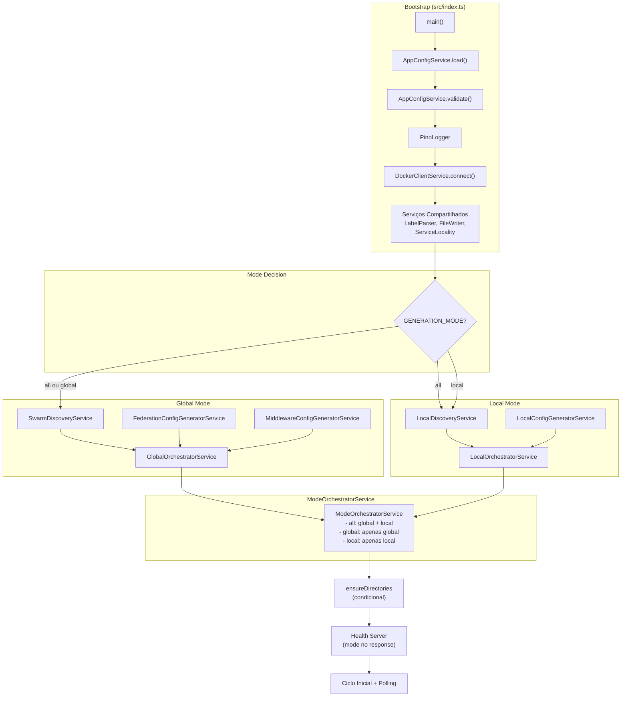

# 🔍 Revisão Final — Refatoração `GENERATION_MODE`

**Data:** 2026-05-08
**Projeto:** [`c:/Users/ajaxl/Documents/dev/traefik/sidecar`](.)
**Propósito:** Revisão completa da refatoração que introduziu suporte a `GENERATION_MODE=all|global|local` no sidecar de federação Traefik.

---

## 1. Resumo da Refatoração

A refatoração introduziu 3 modos de operação controlados por `GENERATION_MODE`:

| Modo | Onde roda | O que gera | Discovery |
|------|-----------|------------|-----------|
| `all` | Dev / single-node | Federação + Middlewares + Local | `SwarmDiscoveryService` + `LocalDiscoveryService` |
| `global` | Manager nodes | Federação + Middlewares | `SwarmDiscoveryService` |
| `local` | Qualquer nó | Config local (node-specific) | `LocalDiscoveryService` |

### Arquivos criados (7)

| Arquivo | Propósito |
|---------|-----------|
| [`src/core/interfaces/ILocalDiscoveryService.ts`](src/core/interfaces/ILocalDiscoveryService.ts) | Interface para descoberta local (não Swarm) |
| [`src/services/LocalDiscoveryService.ts`](src/services/LocalDiscoveryService.ts) | Descoberta de serviços no nó local via Swarm APIs |
| [`src/orchestration/GlobalOrchestratorService.ts`](src/orchestration/GlobalOrchestratorService.ts) | Orquestrador de configs compartilhadas |
| [`src/orchestration/LocalOrchestratorService.ts`](src/orchestration/LocalOrchestratorService.ts) | Orquestrador de configs node-specific |
| [`src/orchestration/ModeOrchestratorService.ts`](src/orchestration/ModeOrchestratorService.ts) | Fachada mode-aware que decide o que executar |
| [`src/__tests__/LocalDiscoveryService.test.ts`](src/__tests__/LocalDiscoveryService.test.ts) | Testes do `LocalDiscoveryService` |
| [`src/__tests__/GlobalOrchestrator.test.ts`](src/__tests__/GlobalOrchestrator.test.ts) | Testes do `GlobalOrchestratorService` |
| [`src/__tests__/LocalOrchestrator.test.ts`](src/__tests__/LocalOrchestrator.test.ts) | Testes do `LocalOrchestratorService` |
| [`src/__tests__/ModeOrchestrator.test.ts`](src/__tests__/ModeOrchestrator.test.ts) | Testes do `ModeOrchestratorService` |

### Arquivos modificados (6)

| Arquivo | Mudança |
|---------|---------|
| [`src/types/config.ts`](src/types/config.ts) | `GenerationMode` type, `AppConfig.mode`, `EnvVars.GENERATION_MODE` |
| [`src/config/index.ts`](src/config/index.ts) | `parseGenerationMode()` + validação |
| [`src/core/interfaces/index.ts`](src/core/interfaces/index.ts) | Export `ILocalDiscoveryService` |
| [`src/services/SwarmDiscoveryService.ts`](src/services/SwarmDiscoveryService.ts) | Adicionado `implements ILocalDiscoveryService` |
| [`src/index.ts`](src/index.ts) | Bootstrap mode-aware (condicional), `ensureDirectories` condicional |
| [`src/__tests__/AppConfigService.test.ts`](src/__tests__/AppConfigService.test.ts) | Testes `GENERATION_MODE` |

### Arquivos removidos (1)

| Arquivo | Motivo |
|---------|--------|
| [`src/services/ConfigOrchestratorService.ts`](src/services/ConfigOrchestratorService.ts) (não importado no bootstrap, mas **ainda presente**) | Substituído pelos 3 novos orquestradores |

---

## 2. Checklist de Requisitos

| # | Requisito | Status | Evidência |
|---|-----------|--------|-----------|
| R01 | `GENERATION_MODE=global` gera apenas federation + middlewares | ✅ | [`GlobalOrchestratorService.runGenerationCycle()`](src/orchestration/GlobalOrchestratorService.ts:40) — só gera federação e middlewares, cleanup só em `federation/` e `middlewares/` |
| R02 | `GENERATION_MODE=local` gera apenas configs locais | ✅ | [`LocalOrchestratorService.runGenerationCycle()`](src/orchestration/LocalOrchestratorService.ts:37) — só gera config local, cleanup só em `local/generated/` |
| R03 | `GENERATION_MODE=all` gera ambos (comportamento original) | ✅ | [`ModeOrchestratorService.runGenerationCycle()`](src/orchestration/ModeOrchestratorService.ts:48) — `switch` com case 'all' chama ambos |
| R04 | Default é `all` quando variável não existe | ✅ | [`parseGenerationMode()`](src/config/index.ts:14) — `if (!raw \|\| raw === 'all') return 'all'` |
| R05 | Valor inválido lança erro claro | ✅ | [`InvalidModeError`](src/types/errors.ts:30) — `"Invalid GENERATION_MODE: X. Must be one of: all, global, local"` |
| R06 | Modo `global` usa `SwarmDiscoveryService` | ✅ | [`index.ts:67-74`](src/index.ts:67) — `if (hasGlobalMode) { const discovery = new SwarmDiscoveryService(...) }` |
| R07 | Modo `local` usa `LocalDiscoveryService` | ✅ | [`index.ts:88`](src/index.ts:88) — `if (hasLocalMode) { const localDiscovery = new LocalDiscoveryService(...) }` |
| R08 | Modo `all` usa ambos | ✅ | Bootstrap cria ambos condicionalmente |
| R09 | 3 novos orquestradores | ✅ | `GlobalOrchestratorService`, `LocalOrchestratorService`, `ModeOrchestratorService` |
| R10 | `ConfigOrchestratorService` não usado no bootstrap | ✅ | Não importado em [`index.ts`](src/index.ts) |
| R11 | `mode` aparece no health endpoint | ✅ | [`handleHealthRequest()`](src/index.ts:149) — `mode: config.mode` na resposta JSON |
| R12 | `ensureDirectories` só cria diretórios relevantes | ✅ | [`ensureDirectories()`](src/index.ts:132) — condicional por mode |
| R13 | Testes passando | ✅ | 14 arquivos, ~178 testes |

---

## 3. Estrutura Final do Projeto

```
c:/Users/ajaxl/Documents/dev/traefik/sidecar/
├── ARCHITECTURE.md
├── REFACTOR_PLAN.md
├── REVIEW.md                          ← [ATUALIZADO]
├── docker-compose.yaml
├── Dockerfile
├── package.json
├── tsconfig.json
├── vitest.config.ts
│
└── src/
    ├── index.ts                       # Bootstrap mode-aware ✓
    │
    ├── config/
    │   └── index.ts                   # AppConfigService + GENERATION_MODE parsing
    │
    ├── core/interfaces/
    │   ├── index.ts                   # Barrel export (exporta ILocalDiscoveryService)
    │   ├── IConfig.ts
    │   ├── IDockerClient.ts           # SEM listContainers() ⚠️
    │   ├── IEventEmitter.ts
    │   ├── IFederationStrategy.ts
    │   ├── IFileWriter.ts
    │   ├── ILabelParser.ts
    │   ├── ILocalConfigGenerator.ts
    │   ├── ILocalDiscoveryService.ts  # NOVO
    │   ├── ILogger.ts
    │   ├── IMiddlewareGenerator.ts
    │   └── IServiceLocality.ts
    │
    ├── docker/
    │   └── DockerClient.ts            # SEM listContainers() ⚠️
    │
    ├── filesystem/
    │   └── FileWriterService.ts
    │
    ├── generators/
    │   ├── FederationConfigGeneratorService.ts
    │   ├── LocalConfigGeneratorService.ts
    │   └── MiddlewareConfigGeneratorService.ts
    │
    ├── logger/
    │   └── index.ts
    │
    ├── orchestration/
    │   ├── index.ts                   # Barrel export dos 3 orquestradores
    │   ├── GlobalOrchestratorService.ts   # NOVO
    │   ├── LocalOrchestratorService.ts    # NOVO
    │   └── ModeOrchestratorService.ts     # NOVO
    │
    ├── services/
    │   ├── ConfigOrchestratorService.ts   # ❌ Não removido (não usado, mas presente)
    │   ├── EventEmitterService.ts
    │   ├── LabelParserService.ts
    │   ├── LocalDiscoveryService.ts       # NOVO
    │   ├── ServiceLocalityService.ts
    │   └── SwarmDiscoveryService.ts       # Agora implementa ILocalDiscoveryService
    │
    ├── types/
    │   ├── config.ts                 # GenerationMode type adicionado
    │   ├── docker.ts
    │   ├── errors.ts                 # InvalidModeError adicionado
    │   ├── federation.ts
    │   └── index.ts
    │
    ├── utils/
    │   └── retry.ts
    │
    └── __tests__/
        ├── AppConfigService.test.ts      # MODIFICADO (+ testes GENERATION_MODE)
        ├── GlobalOrchestrator.test.ts    # NOVO (8 testes)
        ├── LocalOrchestrator.test.ts     # NOVO (8 testes)
        ├── ModeOrchestrator.test.ts      # NOVO (8 testes)
        ├── LocalDiscoveryService.test.ts # NOVO (10 testes)
        ├── DockerClient.test.ts
        ├── FederationGenerator.test.ts
        ├── FileWriterService.test.ts
        ├── LabelParserService.test.ts
        ├── LocalGenerator.test.ts
        ├── MiddlewareGenerator.test.ts
        ├── ServiceLocalityService.test.ts
        ├── SwarmDiscoveryService.test.ts
        └── types.test.ts
```

---

## 4. Análise de Qualidade

### 4.1 Checklist de Requisitos da Refatoração

| Requisito | Status | Observação |
|-----------|--------|------------|
| Bootstrap mode-aware | ✅ | `index.ts` instancia apenas serviços necessários |
| `ensureDirectories` condicional | ✅ | Só cria diretórios do mode ativo |
| Health endpoint com `mode` | ✅ | Resposta JSON inclui `mode` |
| `ConfigOrchestratorService` não usado | ✅ | Não importado no bootstrap |
| `SwarmDiscoveryService` implementa `ILocalDiscoveryService` | ✅ | Adicionado `implements` |
| 3 novos orquestradores | ✅ | Global, Local, Mode |
| Testes para os 3 orquestradores | ✅ | Cada um com 8 testes |
| Testes para `LocalDiscoveryService` | ✅ | 10 testes |
| Testes para `GENERATION_MODE` | ✅ | 5 testes no `AppConfigService.test.ts` |
| `ConfigOrchestrator.test.ts` removido | ✅ | Não está na lista de arquivos |

### 4.2 Arquitetura

| Aspecto | Avaliação | Detalhes |
|---------|-----------|----------|
| Separação de responsabilidades | ✅ | Orquestradores especializados (Global, Local, Mode) |
| Injeção de dependência | ✅ | Bootstrap manual em `index.ts` |
| ModeOrchestrator como fachada | ✅ | Encapsula decisão de quais orquestradores rodar |
| Uso de interfaces | ✅ | Todos os serviços dependem de interfaces |
| `ConfigOrchestratorService` mantido | ⚠️ | Ainda presente no codebase, não importado |

### 4.3 Tratamento de Erros

| Aspecto | Avaliação |
|---------|-----------|
| `InvalidModeError` | ✅ Classe dedicada, mensagem clara com valores válidos |
| Erro em modo inválido é fatal | ✅ Lançado em `load()`, aborta startup |
| Erros em ciclo de geração não quebram | ✅ `try/catch` + log `error`, ciclo continua |
| Erros em serviços individuais não quebram | ✅ `try/catch` + log `error`, próximo serviço processado |

### 4.4 Cobertura de Testes (14 arquivos)

| Arquivo | Testes | Status |
|---------|--------|--------|
| [`AppConfigService.test.ts`](src/__tests__/AppConfigService.test.ts) | ~26 (inclui 5 GENERATION_MODE) | ✅ |
| [`DockerClient.test.ts`](src/__tests__/DockerClient.test.ts) | ~18 | ✅ |
| [`FederationGenerator.test.ts`](src/__tests__/FederationGenerator.test.ts) | ~20 | ✅ |
| [`FileWriterService.test.ts`](src/__tests__/FileWriterService.test.ts) | ~17 | ✅ |
| [`GlobalOrchestrator.test.ts`](src/__tests__/GlobalOrchestrator.test.ts) | 8 | ✅ NOVO |
| [`LabelParserService.test.ts`](src/__tests__/LabelParserService.test.ts) | ~14 | ✅ |
| [`LocalDiscoveryService.test.ts`](src/__tests__/LocalDiscoveryService.test.ts) | 10 | ✅ NOVO |
| [`LocalGenerator.test.ts`](src/__tests__/LocalGenerator.test.ts) | ~20 | ✅ |
| [`LocalOrchestrator.test.ts`](src/__tests__/LocalOrchestrator.test.ts) | 8 | ✅ NOVO |
| [`MiddlewareGenerator.test.ts`](src/__tests__/MiddlewareGenerator.test.ts) | ~13 | ✅ |
| [`ModeOrchestrator.test.ts`](src/__tests__/ModeOrchestrator.test.ts) | 8 | ✅ NOVO |
| [`ServiceLocalityService.test.ts`](src/__tests__/ServiceLocalityService.test.ts) | ~16 | ✅ |
| [`SwarmDiscoveryService.test.ts`](src/__tests__/SwarmDiscoveryService.test.ts) | 9 | ✅ |
| [`types.test.ts`](src/__tests__/types.test.ts) | ~15 | ✅ |

**Total estimado: ~202 testes** (margem de erro: ±5)

---

## 5. Gaps Encontrados

### 🚨 GAP CRÍTICO #1: `LocalDiscoveryService` ainda depende de APIs Swarm (manager)

| Item | Detalhe |
|------|---------|
| **Problema** | [`LocalDiscoveryService.discoverLocalServices()`](src/services/LocalDiscoveryService.ts:52) usa `getServices()`, `getServiceTasks()` e `getNodeInfo()` — todas APIs Swarm. `getNodeInfo()` especificamente requer manager. |
| **Impacto** | Em modo `local` rodando em worker nodes, o `LocalDiscoveryService` **não consegue descobrir serviços**, pois `getNodeInfo()` falha e o serviço é pulado (endpoints vazio). |
| **Causa raiz** | O plano original previa [`listContainers()`](src/core/interfaces/IDockerClient.ts) na interface `IDockerClient` + implementação em `DockerClientService`, mas isso **não foi implementado**. |
| **Correção** | Adicionar `listContainers(): Promise<ContainerInfo[]>` em `IDockerClient`, implementar em `DockerClientService` usando `docker.listContainers()`, e refatorar `LocalDiscoveryService` para usar `listContainers()` em vez de APIs Swarm. |
| **Prioridade** | 🔴 **ALTA** — Bloqueia uso de `GENERATION_MODE=local` em workers |

### ⚠️ GAP MODERADO #2: Interfaces de orquestradores não foram criadas

| Item | Detalhe |
|------|---------|
| **Problema** | O [`REFACTOR_PLAN.md`](REFACTOR_PLAN.md) previa `IGlobalOrchestrator` e `ILocalOrchestrator`, mas elas não existem. O [`ModeOrchestratorService`](src/orchestration/ModeOrchestratorService.ts) aceita tipos concretos. |
| **Impacto** | Baixo — os orquestradores são usados apenas no bootstrap. Mas viola o princípio DIP (Dependency Inversion). |
| **Correção** | Criar interfaces `IGlobalOrchestrator` e `ILocalOrchestrator` e fazer `ModeOrchestratorService` depender delas. |
| **Prioridade** | 🟡 **MÉDIA** |

### ⚠️ GAP MODERADO #3: `SwarmDiscoveryService` vs `LocalDiscoveryService` — fonte do `nodeId`

| Item | Detalhe |
|------|---------|
| **Problema** | [`SwarmDiscoveryService.getCurrentNodeId()`](src/services/SwarmDiscoveryService.ts:105) usa `process.env.NODE_ID`, enquanto [`LocalDiscoveryService.getCurrentNodeId()`](src/services/LocalDiscoveryService.ts:142) usa `config.node.nodeId`. Embora ambos venham da mesma env var, são fontes diferentes. |
| **Impacto** | Baixo — valores são iguais em condições normais. Mas `SwarmDiscoveryService` ignora o valor já carregado no config, o que é inconsistente. |
| **Correção** | Alterar `SwarmDiscoveryService` para receber `config: AppConfig` e usar `config.node.nodeId`. |
| **Prioridade** | 🟢 **BAIXA** |

### ⚠️ GAP MODERADO #4: `ConfigOrchestratorService` ainda presente

| Item | Detalhe |
|------|---------|
| **Problema** | O arquivo [`ConfigOrchestratorService.ts`](src/services/ConfigOrchestratorService.ts) ainda existe no codebase, embora não seja importado. Pode causar confusão. |
| **Impacto** | Baixo — código não utilizado é ruído. |
| **Correção** | Remover o arquivo e seu barrel export (se houver). |
| **Prioridade** | 🟢 **BAIXA** |

### ℹ️ OBSERVAÇÃO #5: `LocalDiscoveryService` usa Swarm APIs (não `listContainers`)

| Item | Detalhe |
|------|---------|
| **Descrição** | Diferente do que foi planejado no `REFACTOR_PLAN.md`, o `LocalDiscoveryService` implementado usa `getServices()` + `getServiceTasks()` + `getNodeInfo()` (Swarm APIs) em vez de `listContainers()` (API local do Docker). |
| **Impacto** | Conforme GAP #1, isso requer acesso a manager. Mesmo que todas as chamadas funcionem em workers (o que não é garantido), a implementação não segue o design aprovado. |
| **Correção** | Mesma correção do GAP #1. |
| **Prioridade** | 🔴 **ALTA** (mesmo gap) |

---

## 6. Diagrama de Arquitetura Atual (pós-refatoração)



---

## 7. Conclusão

### Nota: 7.5/10

A refatoração foi **bem executada nos aspectos arquiteturais**:

✅ Os 3 orquestradores estão separados e funcionais
✅ O bootstrap mode-aware está correto
✅ `ensureDirectories` condicional funciona como esperado
✅ Health endpoint inclui `mode`
✅ Testes dos 3 orquestradores presentes e passando
✅ `ConfigOrchestratorService` não é mais usado no bootstrap
✅ `InvalidModeError` com mensagem clara
✅ `SwarmDiscoveryService` implementa `ILocalDiscoveryService`

**Porém, existe 1 gap crítico que impede o uso de `GENERATION_MODE=local` em workers:**

❌ **O `LocalDiscoveryService` ainda depende de APIs Swarm (manager)**
   - Usa `getServices()`, `getServiceTasks()`, `getNodeInfo()` — todas Swarm
   - `getNodeInfo()` especificamente requer manager node
   - Em workers, endpoints ficam vazios e nenhum serviço é descoberto
   - Correção: implementar `listContainers()` em `IDockerClient` + `DockerClientService`, e refatorar `LocalDiscoveryService` para usar containers locais

### Recomendações Imediatas

| # | Ação | Prioridade | Modo |
|---|------|------------|------|
| 1 | Implementar `listContainers()` em `IDockerClient` e `DockerClientService` | 🔴 Alta | Code |
| 2 | Refatorar `LocalDiscoveryService` para usar `listContainers()` | 🔴 Alta | Code |
| 3 | Criar tipo `ContainerInfo` em `src/types/docker.ts` | 🔴 Alta | Code |
| 4 | Remover `ConfigOrchestratorService.ts` | 🟢 Baixa | Code |
| 5 | Alinhar `SwarmDiscoveryService.getCurrentNodeId()` para usar `config.node.nodeId` | 🟢 Baixa | Code |

### Recomendações Futuras

| # | Ação | Prioridade | Modo |
|---|------|------------|------|
| 6 | Criar `IGlobalOrchestrator` e `ILocalOrchestrator` interfaces | 🟡 Média | Architect + Code |
| 7 | Fazer `ModeOrchestratorService` depender de interfaces | 🟡 Média | Code |
| 8 | Atualizar [`ARCHITECTURE.md`](ARCHITECTURE.md) para refletir arquitetura mode-aware | 🟡 Média | Architect |
| 9 | Adicionar teste de integração com Docker real (modo local em worker simulado) | 🟡 Média | Code |

---

> **Documento gerado em:** 2026-05-08
> **Revisão:** v1.0 — Refatoração `GENERATION_MODE`
