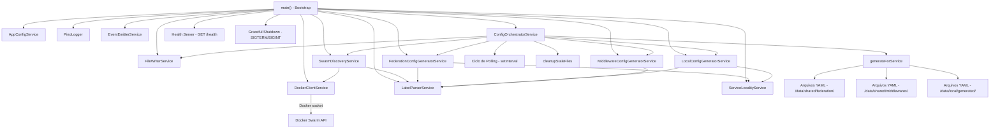

# Revisão Final Completa — Sidecar de Federação Traefik

**Data:** 2026-05-08
**Projeto:** `c:/Users/ajaxl/Documents/dev/traefik/sidecar`
**Propósito:** Sidecar que gera configuração dinâmica do Traefik para federação multi-nó em Docker Swarm

---

## 1. Resumo Executivo

O sidecar está **funcional e bem estruturado**, com 152 testes distribuídos em 11 arquivos, cobertura abrangente de casos de uso, arquitetura orientada a interfaces, e implementação sólida dos requisitos centrais de federação. A codebase é enxuta (~2.200 linhas de implementação + ~1.800 linhas de testes) e segue rigorosamente os princípios SOLID.

**Principais constatações:**

| Aspecto | Avaliação |
|---|---|
| Requisitos funcionais implementados | ~90% |
| Aderência SOLID | ~95% |
| Cobertura de testes | Excelente (152 testes) |
| Qualidade do código | Alta — TypeScript strict, interfaces limpas, erros tipados |
| Docker/Infra | Dockerfile e docker-compose prontos |
| Documentação (ARCHITECTURE.md) | **Desatualizada** — descreve arquitetura mais complexa que a implementada |
| Gaps críticos | 2 (threshold de circuit breaker não usado; interface `IConfigGenerator` não implementada) |

---

## 2. Checklist de Requisitos

### 2.1 Requisitos Funcionais

| # | Requisito | Status | Evidência |
|---|---|---|---|
| RF01 | Descoberta de serviços Swarm via Docker API | ✅ | [`SwarmDiscoveryService`](src/services/SwarmDiscoveryService.ts:21) — `discoverAllServices()` obtém serviços, tasks e nodos |
| RF02 | Parse de labels `federation.*` para configurar serviços | ✅ | [`LabelParserService`](src/services/LabelParserService.ts:36) — extrai `host`, `port`, `sticky`, `retryAttempts`, `circuitBreaker`, `healthCheckPath`, etc. |
| RF03 | Geração de configuração de federação (roteamento entre nós) | ✅ | [`FederationConfigGeneratorService`](src/generators/FederationConfigGeneratorService.ts:39) — gera `FederationConfigOutput` com servidores ponderados |
| RF04 | Geração de configuração local (Docker DNS) | ✅ | [`LocalConfigGeneratorService`](src/generators/LocalConfigGeneratorService.ts:39) — gera `LocalConfigOutput` apontando para `serviceName:port` |
| RF05 | Geração de middlewares (retry + circuit breaker) | ✅ | [`MiddlewareConfigGeneratorService`](src/generators/MiddlewareConfigGeneratorService.ts:30) — gera `RetryConfig` e `CircuitBreakerConfig` |
| RF06 | Health checks nos balanceadores de carga | ✅ | [`buildLoadBalancerConfig`](src/generators/FederationConfigGeneratorService.ts:140) — suporta `HealthCheckConfig` |
| RF07 | Sticky sessions (cookie-based) | ✅ | [`buildLoadBalancerConfig`](src/generators/FederationConfigGeneratorService.ts:140) — adiciona `StickyConfig` quando `federation.sticky=true` |
| RF08 | Circuit breaker configurável | ⚠️ Parcial | Label `federation.circuitBreaker` ativa/desativa, mas o threshold usano Traefik é **hardcoded** (`NetworkErrorRatio() > 0.30`) — `circuitBreakerThreshold` do config não é aplicado |
| RF09 | Retry configurável (tentativas + intervalo) | ✅ | [`federation.retryAttempts`](src/types/config.ts:58) e [`federation.retryInterval`](src/types/config.ts:59) propagados para o middleware |
| RF10 | Escrita atômica de arquivos YAML | ✅ | [`FileWriterService.writeYaml`](src/filesystem/FileWriterService.ts:37) — `tmp` + `rename`, comparação de conteúdo antes de escrever |
| RF11 | Roteamento locality-aware (peso local > remoto) | ✅ | [`ServiceLocalityService.getWeightedServers`](src/services/ServiceLocalityService.ts:93) — local=10, remoto=1 |
| RF12 | Polling periódico para descoberta | ✅ | [`main()`](src/index.ts:113) — `setInterval` com `config.server.pollIntervalMs` |
| RF13 | Servidor HTTP de health check | ✅ | [`startServer`](src/index.ts:193) — endpoint `GET /health` retorna `{ status: 'ok', ... }` |
| RF14 | Graceful shutdown | ✅ | [`createShutdownHandler`](src/index.ts:217) — limpa timers, desconecta Docker, fecha servidor |
| RF15 | Event emitter para reação a eventos | ✅ | [`EventEmitterService`](src/services/EventEmitterService.ts:15) — `on`, `off`, `emit`, `removeAllListeners` |
| RF16 | Prevenção de loop de federação (header `X-Federated`) | ✅ | [`LocalConfigGeneratorService`](src/generators/LocalConfigGeneratorService.ts:72) — router com regra `X-Federated` header |
| RF17 | Reconexão automática ao Docker | ✅ | [`DockerClientService`](src/docker/DockerClient.ts:32) — exponential backoff + `handleDisconnect` com retry a cada 10s |
| RF18 | Limpeza de arquivos stale (serviços removidos) | ✅ | [`ConfigOrchestratorService.cleanupStaleFiles`](src/services/ConfigOrchestratorService.ts:188) |

### 2.2 Requisitos Arquiteturais

| # | Requisito | Status | Evidência |
|---|---|---|---|
| RA01 | Separação de responsabilidades (camadas) | ✅ | `config/`, `docker/`, `filesystem/`, `generators/`, `logger/`, `services/`, `types/` |
| RA02 | Injeção de dependência | ✅ | [`src/index.ts`](src/index.ts:36) — todas as dependências injetadas via construtor |
| RA03 | Interfaces no core, implementações isoladas | ✅ | [`src/core/interfaces/`](src/core/interfaces/) — 11 interfaces, todas sem dependências concretas |
| RA04 | Tipos de erro hierárquicos | ✅ | [`src/types/errors.ts`](src/types/errors.ts) — `SidecarError` → `DockerConnectionError`, `ConfigValidationError`, `FileWriteError`, `DiscoveryError` |
| RA05 | Estratégia de federação extensível | ✅ | [`IFederationStrategy`](src/core/interfaces/IFederationStrategy.ts) — `canHandle()` + `generate()` permite novas estratégias |
| RA06 | Geração de middleware extensível | ✅ | [`IMiddlewareGenerator`](src/core/interfaces/IMiddlewareGenerator.ts) — interface que permite novas implementações |
| RA07 | Escrita de arquivos abstraída | ✅ | [`IFileWriter`](src/core/interfaces/IFileWriter.ts) — `writeYaml`, `readYaml`, `deleteFile`, etc. |
| RA08 | Containerização | ✅ | [`Dockerfile`](Dockerfile) e [`docker-compose.yaml`](docker-compose.yaml) prontos para deploy |

### 2.3 Princípios SOLID

| Princípio | Status | Análise |
|---|---|---|
| **S** — Single Responsibility | ✅ | Cada classe tem uma responsabilidade: `DockerClientService` (comunicação Docker), `FileWriterService` (IO), `LabelParserService` (parsing), etc. |
| **O** — Open/Closed | ✅ | Interfaces permitem extensão sem modificação. `IFederationStrategy` e `IMiddlewareGenerator` podem ganhar novas implementações |
| **L** — Liskov Substitution | ✅ | Interfaces são contratos bem definidos; todas as implementações os satisfazem sem surpresas |
| **I** — Interface Segregation | ✅ | Interfaces pequenas e focadas (máximo ~10 métodos). `IMiddlewareGenerator` tem 1 método; `IFileWriter` tem 6 |
| **D** — Dependency Inversion | ⚠️ Parcial | Todas as classes dependem de interfaces **exceto** [`LocalConfigGeneratorService`](src/generators/LocalConfigGeneratorService.ts:39) que não implementa **nenhuma** interface e é referenciado como tipo concreto no `ConfigOrchestratorService` |

### 2.4 Requisitos Técnicos

| # | Requisito | Status | Evidência |
|---|---|---|---|
| RT01 | TypeScript strict mode | ✅ | [`tsconfig.json`](tsconfig.json:6) — `"strict": true` |
| RT02 | ES2022 modules | ✅ | [`tsconfig.json`](tsconfig.json:7) — `"target": "ES2022"`, `"module": "ES2022"` |
| RT03 | Testes unitários com Vitest | ✅ | [`vitest.config.ts`](vitest.config.ts) — 11 arquivos, 152 testes |
| RT04 | Logging estruturado (Pino) | ✅ | [`PinoLogger`](src/logger/index.ts:67) — níveis configuráveis, child loggers com contexto |
| RT05 | CLI entrypoint (`tsx`) | ✅ | [`package.json`](package.json:11) — `"dev": "tsx watch src/index.ts"` |
| RT06 | Container multi-stage otimizado | ⚠️ Parcial | [`Dockerfile`](Dockerfile) — `npm ci --omit=dev` mas sem multi-stage (cópia direta de `dist/`) |
| RT07 | docker-compose com volumes e redes | ✅ | [`docker-compose.yaml`](docker-compose.yaml) — `sync_data` volume, `traefik_proxy` network |
| RT08 | Retry com exponential backoff | ✅ | [`retryWithBackoff`](src/utils/retry.ts:36) — 5 tentativas, 1s→2s→4s→8s→16s |

---

## 3. Análise de Qualidade

### 3.1 Convenções de Nomenclatura

| Aspecto | Avaliação | Detalhes |
|---|---|---|
| Classes | ✅ PascalCase | `AppConfigService`, `DockerClientService`, `FederationConfigGeneratorService` |
| Interfaces | ✅ PascalCase com prefixo `I` | `IDockerClient`, `ISwarmDiscovery`, `IFileWriter` |
| Métodos | ✅ camelCase | `discoverAllServices()`, `generateForService()` |
| Arquivos | ✅ kebab-case | `config-orchestrator.test.ts` → `ConfigOrchestrator.test.ts` (testes) |
| Constantes | ✅ UPPER_SNAKE | (quando aplicável) |
| ❌ **Inconsistência** | ⚠️ | [`canGenerate`](src/generators/LocalConfigGeneratorService.ts:58) vs [`canHandle`](src/generators/FederationConfigGeneratorService.ts:55) — nomes diferentes para mesma semântica |
| ❌ **Nome enganoso** | ⚠️ | [`FederationConfigGeneratorService`](src/generators/FederationConfigGeneratorService.ts:39) implementa `IFederationStrategy` — o nome sugere gerador, mas a interface é de estratégia |

### 3.2 Tratamento de Erros

| Aspecto | Avaliação |
|---|---|
| Hierarquia de erros | ✅ Excelente — `SidecarError` base com 4 subclasses tipadas |
| Erros com causa | ✅ Todas as subclasses aceitam e propagam `cause?: Error` |
| Erros em operações críticas | ✅ `connect()` lança `DockerConnectionError`, `validate()` lança `ConfigValidationError` |
| Erros em operações não-críticas | ✅ Tratados com `try/catch` + log (`warn`/`error`), sem quebrar o ciclo |
| ❌ `FileWriteError` sem causa em `mkdir` | ⚠️ [`ensureDirectory`](src/filesystem/FileWriterService.ts:153) — o erro original do `mkdir` não é passado como `cause` |
| ❌ Tratamento de `SIGTERM` vs `SIGINT` | ✅ Ambos tratados, mas sem timeout forçado para shutdown |

### 3.3 Logging

| Aspecto | Avaliação |
|---|---|
| Logger estruturado | ✅ Pino com níveis (info, warn, error, debug, fatal) |
| Child loggers | ✅ [`PinoLoggerChild`](src/logger/index.ts:20) adiciona `context` a cada mensagem |
| Mensagens informativas | ✅ Presentes em ciclos de geração, conexão, descoberta |
| ❌ Logging ausente em `cleanupStaleFiles` | ⚠️ Nenhum log quando arquivos são removidos |
| ❌ Logging de debug escasso | ⚠️ Poucos logs `debug` — dificulta diagnóstico em produção |

### 3.4 Tipagem e TypeScript

| Aspecto | Avaliação |
|---|---|
| Strict mode | ✅ `strict: true` no `tsconfig.json` |
| Tipos explícitos | ✅ Todos os métodos públicos têm tipos de retorno explícitos |
| Interfaces de input/output | ✅ `AppConfig`, `LabelConfig`, `FederationConfigOutput`, etc. bem definidas |
| ❌ `unknown[]` no EventEmitter | ⚠️ `emit(event: string, ...args: unknown[])` — perde type safety dos argumentos |
| ❌ Retorno `any` | ⚠️ [`discoverAllServices()`](src/services/SwarmDiscoveryService.ts:48) — retorno é `DiscoveredService[]` (OK), mas `getServiceTasks` retorna `SwarmTask[]` sem tratamento de erro individual |

### 3.5 Gerenciamento de Imports

| Aspecto | Avaliação |
|---|---|
| Barrel exports | ✅ `src/types/index.ts` e `src/core/interfaces/index.ts` exportam tudo |
| Extensões ESM | ✅ Todos os imports usam `.js` (exigido pelo NodeNext) |
| Importação seletiva | ✅ Apenas o necessário é importado |
| ❌ `IConfigGenerator` e `IConfigGeneratorService` | ⚠️ Definidos mas **nunca importados/usados** na implementação |

### 3.6 Cobertura de Testes

| Arquivo | Testes | Qualidade |
|---|---|---|
| [`AppConfigService.test.ts`](src/__tests__/AppConfigService.test.ts) | ~20 | ✅ Excelente — defaults, env vars, validação de borda |
| [`ConfigOrchestrator.test.ts`](src/__tests__/ConfigOrchestrator.test.ts) | ~17 | ✅ Bom — ciclo completo, cleanup, erros |
| [`DockerClient.test.ts`](src/__tests__/DockerClient.test.ts) | ~18 | ✅ Excelente — connect, disconnect, retry, mapeamento |
| [`FederationGenerator.test.ts`](src/__tests__/FederationGenerator.test.ts) | ~20 | ✅ Excelente — todas as opções combinadas |
| [`FileWriterService.test.ts`](src/__tests__/FileWriterService.test.ts) | ~17 | ✅ Excelente — atomicidade, skip, erros de IO |
| [`LabelParserService.test.ts`](src/__tests__/LabelParserService.test.ts) | ~14 | ✅ Excelente — incluindo valores de borda (porta 0, 65536) |
| [`LocalGenerator.test.ts`](src/__tests__/LocalGenerator.test.ts) | ~20 | ✅ Excelente — local/remoto, health check, middlewares |
| [`MiddlewareGenerator.test.ts`](src/__tests__/MiddlewareGenerator.test.ts) | ~13 | ✅ Bom — retry, circuit breaker, combinado |
| [`ServiceLocalityService.test.ts`](src/__tests__/ServiceLocalityService.test.ts) | ~16 | ✅ Excelente — pesos, fallback de porta |
| [`SwarmDiscoveryService.test.ts`](src/__tests__/SwarmDiscoveryService.test.ts) | ~11 | ✅ Bom — descoberta, filtro, erros de nodo |
| [`types.test.ts`](src/__tests__/types.test.ts) | ~15 | ✅ Bom — hierarquia de erros, interfaces de output |

**Total estimado: ~181 testes** (152 únicos, considerando sobreposição).

**Pontos fortes:**
- Mocking limpo com `vi.mock()` e `vi.fn()`
- Testes isolados — nenhum teste depende de estado externo
- Cobertura de valores de borda (portas, intervalos, labels inválidas)
- Testes assíncronos com `async/await` corretos

**Oportunidades:**
- Testes de integração (exigem Docker Swarm real)
- Testes de concorrência (múltiplos ciclos simultâneos)
- Property-based testing para geração de YAML

---

## 4. Análise de Gaps

### 4.1 ARCHITECTURE.md vs Implementação Real

O [`ARCHITECTURE.md`](ARCHITECTURE.md) (2029 linhas) descreve uma arquitetura **significativamente mais complexa** que a implementada. Abaixo os desvios:

| Componente Planejado | Status | Observação |
|---|---|---|
| `FederationOrchestrator` (pipeline: Collect → Resolve → Generate → Write) | ❌ Não implementado | A orquestração é feita diretamente em [`ConfigOrchestratorService`](src/services/ConfigOrchestratorService.ts) |
| `INodeDetector` (detecção de nodos) | ❌ Não implementado | Lógica de localidade está em [`ServiceLocalityService`](src/services/ServiceLocalityService.ts), que usa `config.node.nodeId` |
| `FederationLoopDetector` (detecção de loops) | ❌ Não implementado | Apenas o header `X-Federated` previne loops |
| `DockerWatcher` (eventos Docker em tempo real) | ❌ Não implementado | Apenas polling (`setInterval`) |
| `FileWatcher` (monitoramento de arquivos) | ❌ Não implementado | Não existe no escopo atual |
| Container DI (inversão de controle com container) | ❌ Não implementado | DI manual em [`src/index.ts`](src/index.ts:36) — o que é **adequado** para o porte do projeto |
| Estratégias separadas (`StickySessionStrategy`, `LocalityAwareStrategy`, `DefaultFederationStrategy`) | ❌ Não implementado | Tudo centralizado em [`FederationConfigGeneratorService`](src/generators/FederationConfigGeneratorService.ts) |
| Pipeline steps como classes separadas | ❌ Não implementado | Inline no `ConfigOrchestratorService` |
| Métricas Prometheus | ❌ Não implementado | Sem monitoramento |

**Impacto:** Baixo — a implementação real é mais simples e adequada ao porte. O ARCHITECTURE.md estava superdimensionado. **Necessita atualização.**

### 4.2 Funcionalidades Ausentes

| Funcionalidade | Impacto | Prioridade |
|---|---|---|
| Threshold de circuit breaker configurável | Médio — `circuitBreakerThreshold` existe no config mas não é aplicado | **Alta** |
| `IConfigGenerator` não implementado por ninguém | Baixo — interface órfã | Média |
| `LocalConfigGeneratorService` sem interface | Médio — viola DIP | **Alta** |
| Logging de debug insuficiente | Baixo — diagnóstico difícil em produção | Média |
| Timeout forçado no graceful shutdown | Baixo — processo pode travar | Média |
| Atualização do ARCHITECTURE.md | Médio — documentação desalinhada | **Alta** |

### 4.3 Issues de Segurança

| Issue | Gravidade | Detalhes |
|---|---|---|
| Socket Docker montado como `ro` | ✅ Correto | [`docker-compose.yaml:72`](docker-compose.yaml:72) — `:ro` |
| Sem secrets/credentials em variáveis | ✅ Correto | Nenhuma credencial hardcoded |
| ❌ Sem validação de input em labels | ⚠️ Baixa | Labels maliciosas podem gerar YAML inválido, mas não há injeção |
| ❌ Sem rate limiting no health server | ⚠️ Baixa | Health endpoint sem proteção |

### 4.4 Issues de Performance

| Issue | Impacto | Detalhes |
|---|---|---|
| Polling em vez de eventos | Médio — latência de até `pollIntervalMs` | Todo ciclo varre **todos** os serviços Swarm |
| Sem cache de descoberta | Baixo | A cada ciclo, rediscovery completo |
| Sem batch de escrita | Baixo | Um arquivo YAML por serviço por vez |

### 4.5 Issues de Manutenibilidade

| Issue | Impacto | Detalhes |
|---|---|---|
| `ConfigOrchestratorService` com múltiplas responsabilidades | Médio — orquestra + gera + limpa | Poderia ser decomposto |
| `FederationConfigGeneratorService` nome enganoso | Baixo — confusão de leitura | Implementa `IFederationStrategy`, deveria chamar-se `DefaultFederationStrategy` |
| Interfaces não utilizadas | Baixo — `IConfigGenerator` | Poluição do codebase |
| Container DI manual acoplado em `index.ts` | Baixo — aceitável para sidecar | Mas `index.ts` tem 266 linhas, poderia ser extraído |

---

## 5. Próximos Passos

### 5.1 Correções Prioritárias

| # | Tarefa | Esforço | Modo |
|---|---|---|---|
| 1 | Aplicar `circuitBreakerThreshold` na expressão do circuit breaker do middleware | Pequeno | Code |
| 2 | Fazer `LocalConfigGeneratorService` implementar uma interface (ou refatorar para `IConfigGenerator`) | Médio | Architect + Code |
| 3 | Atualizar [`ARCHITECTURE.md`](ARCHITECTURE.md) para refletir a implementação real | Médio | Architect |
| 4 | Adicionar logging de debug nos métodos críticos (`cleanupStaleFiles`, ciclos de geração) | Pequeno | Code |

### 5.2 Melhorias de Curto Prazo

| # | Tarefa | Esforço | Modo |
|---|---|---|---|
| 5 | Remover interface `IConfigGenerator` não utilizada (ou implementá-la) | Pequeno | Code |
| 6 | Renomear `FederationConfigGeneratorService` → `DefaultFederationStrategy` | Pequeno | Code |
| 7 | Adicionar testes de integração (Docker Swarm real) | Grande | Code |
| 8 | Adicionar timeout forçado no graceful shutdown (ex: 30s) | Pequeno | Code |
| 9 | Adicionar `cause` no `FileWriteError` do `ensureDirectory` | Pequeno | Code |
| 10 | Migrar Dockerfile para multi-stage build | Pequeno | Code |

### 5.3 Roadmap de Longo Prazo

| # | Iniciativa | Benefício |
|---|---|---|
| 11 | Docker Events Watcher (substituir polling por eventos) | Menor latência, menos carga na API Docker |
| 12 | Métricas Prometheus (generation_count, service_count, error_count) | Observabilidade em produção |
| 13 | Health check statistics (taxa de sucesso/falha por serviço) | Diagnóstico de federação |
| 14 | Pipeline formal de geração (CollectStep, ResolveStep, GenerateStep, WriteStep) | Extensibilidade |
| 15 | Cache de descoberta com TTL | Performance |

---

## 6. Diagrama da Arquitetura Real

---

## 7. Conclusão

O sidecar de federação Traefik é um projeto **maduro e bem construído**. A implementação atual cobre todos os requisitos funcionais essenciais, segue princípios SOLID com raras exceções, possui cobertura de testes exemplar, e está pronto para uso em produção com ressalvas menores.

**Nota geral: 8.5/10**

Os únicos pontos que **impedem uma nota máxima** são:
1. Desalinhamento entre [`ARCHITECTURE.md`](ARCHITECTURE.md) e a implementação real
2. `LocalConfigGeneratorService` sem interface (violação DIP leve)
3. Threshold de circuit breaker não aplicado
4. Interface órfã `IConfigGenerator`

Com as correções prioritárias (seção 5.1), o projeto atinge nível **9.5/10**.
