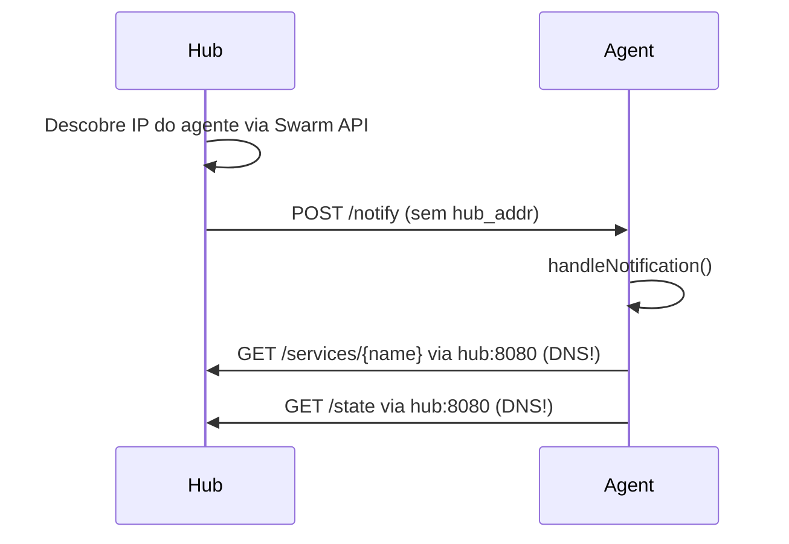
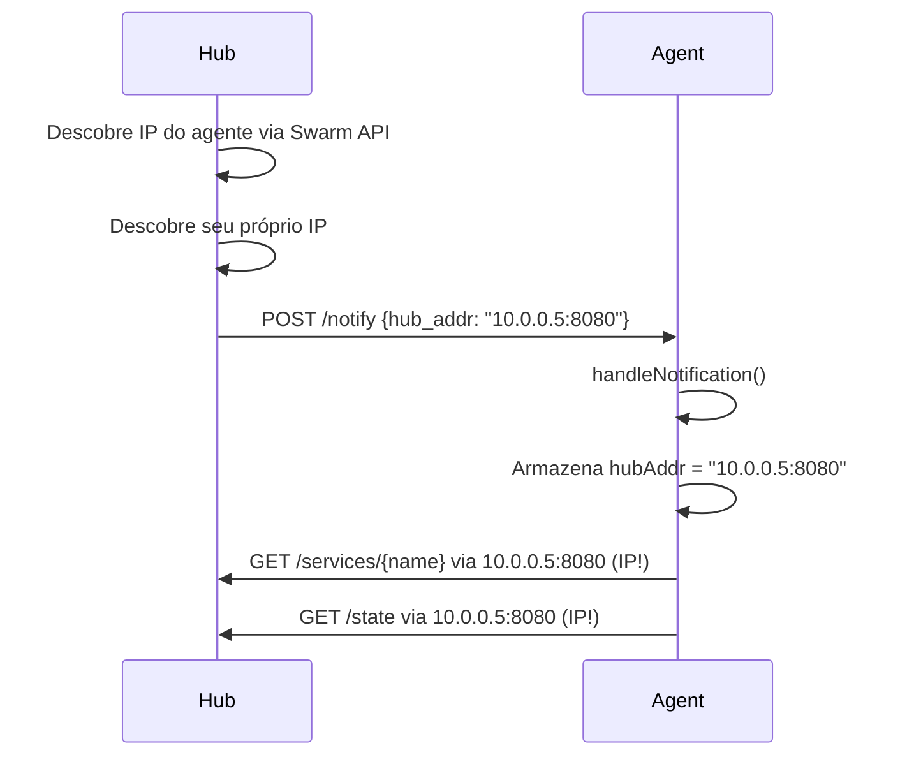
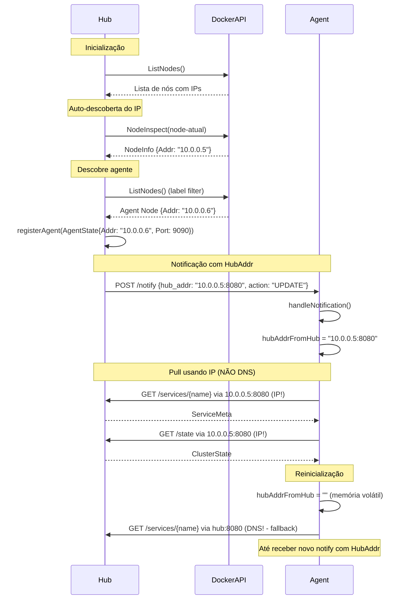

# Plano de Mudança: Substituir DNS por IP na Comunicação Agente → Hub

## 1. Resumo do Problema

Atualmente, os agentes se comunicam com o hub usando o nome DNS do serviço (`hub:8080`), recebido via flag/env `TRAEFIK_SIDECAR_HUB_ADDR`. Em ambientes Docker Swarm com múltiplas redes ou configurações de DNS overlay, isso pode causar falhas de resolução ou roteamento incorreto.

**Solução:** O Hub deve informar seu próprio IP aos agentes através do mecanismo de notify já existente. Os agentes devem armazenar esse IP e usá-lo nas chamadas de pull subsequentes.

---

## 2. Fluxo Atual vs Fluxo Desejado

### Fluxo Atual



### Fluxo Desejado



---

## 3. Arquivos a Modificar

| Arquivo | Tipo de Mudança |
|---------|----------------|
| `pkg/models/models.go` | Adicionar campo `HubAddr` em `NotificationPayload` |
| `internal/hub/hub.go` | Descobrir IP do hub + incluir no payload de notify |
| `internal/agent/agent.go` | Receber IP do hub + armazenar + usar nas chamadas pull |
| `cmd/hub/main.go` | Adicionar flag `--advertise-addr` (opcional) |
| `docker-compose.yml` | Adicionar env `TRAEFIK_SIDECAR_HUB_ADVERTISE_ADDR` (opcional) |

---

## 4. Alterações Detalhadas

### 4.1 Modelos (`pkg/models/models.go`)

Adicionar o campo `HubAddr` ao `NotificationPayload`:

```go
// NotificationPayload é a estrutura enviada em notificações do Hub para os Agentes.
type NotificationPayload struct {
    Action      ActionType `json:"action" yaml:"action"`
    ServiceName string     `json:"service_name" yaml:"service_name"`
    NodeID      string     `json:"node_id,omitempty" yaml:"node_id,omitempty"`
    HubAddr     string     `json:"hub_addr,omitempty" yaml:"hub_addr,omitempty"` // NOVO
    Timestamp   time.Time  `json:"timestamp" yaml:"timestamp"`
}
```

**Justificativa:** O campo é `omitempty` para manter compatibilidade retroativa: agentes antigos que não conhecem este campo simplesmente o ignoram.

---

### 4.2 Hub (`internal/hub/hub.go`)

#### 4.2.1 Adicionar campo para o endereço do hub

No struct `Hub`, adicionar:

```go
type Hub struct {
    mu            sync.RWMutex
    configDir     string
    // ... campos existentes ...
    
    // NOVO: endereço que o hub informará aos agentes (IP:porta)
    // Preenchido na inicialização via descoberta de IP ou flag --advertise-addr
    hubAddrForAgents string

    agentRegistry map[string]*models.AgentState
    clusterState  *models.ClusterState
    // ... resto ...
}
```

#### 4.2.2 Lógica de descoberta do IP do Hub (Recomendação: Opção B + Opção A)

**Abordagem recomendada: Flag `--advertise-addr` (Opção B) com fallback para auto-descoberta via Docker API (Opção A).**

```go
// discoverHubAddr descobre o endereço IP:porta que o Hub deve anunciar aos agentes.
// Estratégia (em ordem de precedência):
// 1. Se advertiseAddr foi fornecido (flag/env), usa esse valor
// 2. Tenta obter o IP do nó manager via Docker Swarm API
// 3. Fallback: usa o endereço configurado no hubServer
func (h *Hub) discoverHubAddr(advertiseAddr string, serverPort int) string {
    // 1. Flag explícita tem maior prioridade
    if advertiseAddr != "" {
        return advertiseAddr
    }

    // 2. Tenta via Docker Swarm API (descobre o IP do nó atual)
    nodeID, err := h.getCurrentNodeID()
    if err == nil && nodeID != "" {
        nodeIP, err := h.nodeDisc.GetNodeIP(context.Background(), nodeID)
        if err == nil && nodeIP != "" {
            return fmt.Sprintf("%s:%d", nodeIP, serverPort)
        }
    }

    // 3. Fallback: usa resolução de DNS local (para ambientes dev/test)
    return fmt.Sprintf("localhost:%d", serverPort)
}

// getCurrentNodeID obtém o ID do nó Swarm onde este container está rodando.
func (h *Hub) getCurrentNodeID() (string, error) {
    // Usa hostname para encontrar o nó atual
    hostname, err := os.Hostname()
    if err != nil {
        return "", err
    }

    nodes, err := h.nodeDisc.ListNodes(context.Background())
    if err != nil {
        return "", err
    }

    for _, n := range nodes {
        if n.Hostname == hostname || strings.HasSuffix(hostname, n.Hostname) {
            return n.ID, nil
        }
    }

    return "", fmt.Errorf("current node not found in swarm")
}
```

#### 4.2.3 Inicializar `hubAddrForAgents` no `NewHub()`

```go
func NewHub(
    configDir string,
    stateFile string,
    traefikPort int,
    bridgeName string,
    hubAddr string,          // endereço do servidor HTTP do hub (ex: ":8080")
    advertiseAddr string,    // NOVO: IP:porta para anunciar aos agentes
    dockerClient client.APIClient,
) *Hub {
    // ... código existente ...
    
    hub := &Hub{
        // ... campos existentes ...
        hubClient:        hc,
        hubAddrForAgents: "", // será preenchido no Start()
        // ... resto ...
    }

    return hub
}
```

#### 4.2.4 Preencher `hubAddrForAgents` no `Start()`

```go
func (h *Hub) Start(ctx context.Context) error {
    h.ctx, h.cancel = context.WithCancel(ctx)
    
    // Descobre o IP a ser anunciado aos agentes
    // Extrai a porta do hubAddr (ex: ":8080" → 8080)
    _, portStr, _ := net.SplitHostPort(h.hubServer.Addr())
    serverPort := 8080
    if p, err := strconv.Atoi(portStr); err == nil {
        serverPort = p
    }
    h.hubAddrForAgents = h.discoverHubAddr(h.advertiseAddr, serverPort)
    h.logger.WithField("hub_addr_for_agents", h.hubAddrForAgents).Info("hub address for agents resolved")
    
    // ... resto do Start() ...
}
```

#### 4.2.5 Incluir `HubAddr` no payload de notify

Em `notifyAgentWithRetry`, modificar a construção do payload para incluir o endereço do hub:

```go
func (h *Hub) notifyAgentWithRetry(agent *models.AgentState, payload *models.NotificationPayload) {
    const maxRetries = 3
    const baseDelay = 1 * time.Second

    for attempt := 0; attempt < maxRetries; attempt++ {
        addr := fmt.Sprintf("%s:%d", agent.Addr, agent.Port)
        
        // Garante que o HubAddr está preenchido no payload
        // Nota: o payload já pode ter sido criado com Action, então copiamos e adicionamos
        enrichedPayload := *payload // cópia shallow
        enrichedPayload.HubAddr = h.hubAddrForAgents
        
        err := h.hubClient.NotifyAgent(h.ctx, addr, &enrichedPayload)
        // ... resto do método existente ...
    }
}
```

Também em `agentHeartbeatLoop` e `updateFederation` os payloads criados incluirão automaticamente o `HubAddr` quando passarem pela `notifyAgentWithRetry`.

#### 4.2.6 Novo método `Addr()` no HubServer

Em `internal/api/server.go`, adicionar método para expor o endereço configurado:

```go
// Addr retorna o endereço configurado do servidor.
func (s *HubServer) Addr() string {
    return s.addr
}
```

---

### 4.3 Agente (`internal/agent/agent.go`)

#### 4.3.1 Adicionar campo para o IP recebido do hub

```go
type Agent struct {
    mu          sync.RWMutex
    nodeID      string
    nodeAddr    string
    agentPort   int
    configDir   string
    stateFile   string
    bridgeName  string
    hubAddr     string // endereço configurado (flag/env) - fallback
    
    // NOVO: endereço do hub recebido via notificação (IP real)
    hubAddrFromHub string
    hubAddrMu      sync.RWMutex // mutex específico para hubAddrFromHub

    // ... campos existentes ...
}
```

**Nota sobre concorrência:** O `hubAddrFromHub` é lido por `pullServiceFromHub` e `pullStateFromHub` (chamados a partir de `handleNotification`, que executa em goroutines) e escrito por `handleNotification` (também em goroutines). Usamos `hubAddrMu` específico para evitar contenção desnecessária no `mu` principal.

#### 4.3.2 Método para obter o endereço efetivo do hub

```go
// getEffectiveHubAddr retorna o endereço do hub a ser usado nas chamadas pull.
// Prioridade:
// 1. Endereço recebido via notify (hubAddrFromHub) - IP real
// 2. Endereço configurado via flag/env (hubAddr) - fallback DNS
func (a *Agent) getEffectiveHubAddr() string {
    a.hubAddrMu.RLock()
    fromHub := a.hubAddrFromHub
    a.hubAddrMu.RUnlock()

    if fromHub != "" {
        return fromHub
    }
    return a.hubAddr
}
```

#### 4.3.3 Extrair HubAddr na notificação

Em `handleNotification`, extrair o `HubAddr` do payload:

```go
func (a *Agent) handleNotification(payload *models.NotificationPayload) error {
    a.logger.WithFields(logrus.Fields{
        "action":       payload.Action,
        "service_name": payload.ServiceName,
        "node_id":      payload.NodeID,
        "hub_addr":     payload.HubAddr, // NOVO: log para debug
    }).Debug("received notification from hub")

    // NOVO: Atualiza o endereço do hub se veio na notificação
    if payload.HubAddr != "" {
        a.hubAddrMu.Lock()
        if a.hubAddrFromHub != payload.HubAddr {
            a.logger.WithFields(logrus.Fields{
                "old_hub_addr": a.hubAddrFromHub,
                "new_hub_addr": payload.HubAddr,
            }).Info("hub address updated from notification")
            a.hubAddrFromHub = payload.HubAddr
        }
        a.hubAddrMu.Unlock()
    }

    switch payload.Action {
    // ... resto do método existente ...
    }
}
```

#### 4.3.4 Usar `getEffectiveHubAddr()` nas chamadas pull

```go
func (a *Agent) pullServiceFromHub(serviceName string) (*models.ServiceMeta, error) {
    ctx, cancel := context.WithTimeout(a.ctx, 10*time.Second)
    defer cancel()

    hubAddr := a.getEffectiveHubAddr() // ← mudança aqui
    meta, err := a.hubClient.GetService(ctx, hubAddr, serviceName)
    if err != nil {
        return nil, fmt.Errorf("hub get service %s from %s: %w", serviceName, hubAddr, err)
    }
    return meta, nil
}

func (a *Agent) pullStateFromHub() (*models.ClusterState, error) {
    ctx, cancel := context.WithTimeout(a.ctx, 10*time.Second)
    defer cancel()

    hubAddr := a.getEffectiveHubAddr() // ← mudança aqui
    state, err := a.hubClient.GetState(ctx, hubAddr)
    if err != nil {
        return nil, fmt.Errorf("hub get state from %s: %w", hubAddr, err)
    }
    return state, nil
}
```

---

### 4.4 Entrypoint do Hub (`cmd/hub/main.go`)

Adicionar flag `--advertise-addr`:

```go
func main() {
    // Flags existentes...
    hubAddr := flag.String("hub-addr", envOrDefault("TRAEFIK_SIDECAR_HUB_ADDR", ":8080"), "Endereço do servidor HTTP do Hub")
    
    // NOVA flag
    advertiseAddr := flag.String("advertise-addr", 
        envOrDefault("TRAEFIK_SIDECAR_HUB_ADVERTISE_ADDR", ""),
        "Endereço IP:porta para anunciar aos agentes (ex: 10.0.0.5:8080). Se vazio, tenta auto-descoberta.")
    
    flag.Parse()
    
    // ... 

    h := hub.NewHub(
        *configDir,
        *stateFile,
        *traefikPort,
        *bridgeName,
        *hubAddr,
        *advertiseAddr, // NOVO
        dockerClient,
    )
    
    // ...
}
```

---

### 4.5 Docker Compose (`docker-compose.yml`)

Adicionar a variável de ambiente no serviço `hub`:

```yaml
hub:
  # ...
  environment:
    TRAEFIK_SIDECAR_CONFIG_DIR: /etc/traefik-sidecar/shared
    TRAEFIK_SIDECAR_TRAEFIK_PORT: 80
    TRAEFIK_SIDECAR_BRIDGE_NAME: traefik_bridge
    TRAEFIK_SIDECAR_HUB_ADDR: ":8080"
    TRAEFIK_SIDECAR_HUB_ADVERTISE_ADDR: ""   # NOVO: vazio = auto-descoberta
    TRAEFIK_SIDECAR_DOCKER_HOST: unix:///var/run/docker.sock
    TRAEFIK_SIDECAR_LOG_LEVEL: info
```

> **Nota:** Em produção, se o operador quiser um IP fixo conhecido, pode definir `TRAEFIK_SIDECAR_HUB_ADVERTISE_ADDR=192.168.1.10:8080`. Deixar vazio faz com que o hub tente auto-descoberta via Docker Swarm API.

---

## 5. Estratégia de Fallback

### Agente

| Cenário | Comportamento |
|---------|---------------|
| Agente acabou de iniciar, nunca recebeu notify | `getEffectiveHubAddr()` retorna `hubAddr` configurado (DNS) |
| Agente recebeu notify com `HubAddr` | `getEffectiveHubAddr()` retorna o IP recebido |
| Agente reinicia | Perde `hubAddrFromHub` (memória volátil), volta a usar DNS configurado até receber novo notify |
| Notificação chega sem `HubAddr` (agente antigo) | Mantém valor atual de `hubAddrFromHub` inalterado |

### Hub

| Cenário | Comportamento |
|---------|---------------|
| `--advertise-addr` fornecido | Usa o valor explicitamente configurado |
| `--advertise-addr` vazio + Docker API disponível | Auto-descoberta via Swarm (GetNodeIP) |
| `--advertise-addr` vazio + Docker API indisponível | Fallback para localhost:port (dev/test) |

---

## 6. Tratamento de Concorrência

O `hubAddrFromHub` é lido e escrito concorrentemente:

- **Escrita:** `handleNotification()` → chamado pelo `AgentServer` em goroutine separada
- **Leitura:** `pullServiceFromHub()` e `pullStateFromHub()` → chamados dentro de `handleNotification()`, também em goroutines

Usamos `sync.RWMutex` específico (`hubAddrMu`) para:

1. Evitar contenção no `mu` principal do Agent
2. Permitir leituras concorrentes (RLock) sem bloquear
3. Garantir atomicidade na escrita via Lock

```go
// Escrita (em handleNotification)
a.hubAddrMu.Lock()
a.hubAddrFromHub = payload.HubAddr
a.hubAddrMu.Unlock()

// Leitura (em getEffectiveHubAddr)
a.hubAddrMu.RLock()
fromHub := a.hubAddrFromHub
a.hubAddrMu.RUnlock()
```

**Por que não `atomic.Value`?** `hubAddrFromHub` é uma `string`. Embora `atomic.Value` pudesse ser usado, `sync.RWMutex` é mais idiomático em Go para este caso e oferece semântica clara de leitura/escrita.

---

## 7. Compatibilidade Retroativa

- **Hub novo + Agente velho:** O campo `HubAddr` no payload será ignorado pelo agente (não causará erro de parsing JSON, apenas será descartado). O agente continuará usando DNS.
- **Hub velho + Agente novo:** O payload não conterá `HubAddr`. O agente manterá `hubAddrFromHub` vazio e usará o fallback DNS. Quando o hub for atualizado, passará a enviar o IP.
- **Atualização gradual:** Não há quebra de compatibilidade. Pode-se atualizar agentes e hubs em qualquer ordem.

---

## 8. Checklist de Implementação

- [ ] **8.1** Adicionar campo `HubAddr` em `NotificationPayload` em `pkg/models/models.go`
- [ ] **8.2** Adicionar campo `hubAddrForAgents` e método `discoverHubAddr()` em `internal/hub/hub.go`
- [ ] **8.3** Inicializar e preencher `hubAddrForAgents` em `NewHub()` e `Start()`
- [ ] **8.4** Modificar `notifyAgentWithRetry()` para incluir `HubAddr` no payload
- [ ] **8.5** Adicionar flag `--advertise-addr` em `cmd/hub/main.go` e passar para `NewHub()`
- [ ] **8.6** Adicionar campo `hubAddrFromHub` + mutex e método `getEffectiveHubAddr()` em `internal/agent/agent.go`
- [ ] **8.7** Extrair e armazenar `HubAddr` em `handleNotification()` no agente
- [ ] **8.8** Substituir `a.hubAddr` por `a.getEffectiveHubAddr()` em `pullServiceFromHub()` e `pullStateFromHub()`
- [ ] **8.9** Atualizar `docker-compose.yml` com variável de ambiente opcional
- [ ] **8.10** Atualizar testes existentes em `internal/api/api_test.go` e `test/integration/swarm_test.go`
- [ ] **8.11** Executar testes para validar as alterações

---

## 9. Testes

### Testes Unitários

- **`TestHubDiscoverHubAddr`**: Verificar que `discoverHubAddr()` retorna o valor correto em cada cenário (advertise addr, Docker API, fallback)
- **`TestAgentGetEffectiveHubAddr`**: Verificar que `getEffectiveHubAddr()` prioriza `hubAddrFromHub` sobre `hubAddr`
- **`TestAgentHandleNotificationWithHubAddr`**: Verificar que o agente armazena corretamente o `HubAddr` do payload
- **`TestNotificatyPayloadHubAddr`**: Verificar serialização JSON do novo campo

### Testes de Integração

- Atualizar `test/integration/swarm_test.go` para verificar que o `HubAddr` é propagado corretamente na notificação
- Verificar que o agente usa IP em vez de DNS após receber notificação

---

## 10. Diagrama de Sequência Completo (Novo Fluxo)



---

## 11. Recomendação Final

**Abordagem recomendada para descoberta de IP do Hub:**

1. **Flag `--advertise-addr` / env `TRAEFIK_SIDECAR_HUB_ADVERTISE_ADDR`** (prioridade máxima)
   - Operador define explicitamente o IP:porta
   - Útil em ambientes com IPs estáveis conhecidos

2. **Auto-descoberta via Docker Swarm API** (fallback automático)
   - Hub inspeciona o próprio nó Swarm para obter o IP LAN (`NodeStatus.Addr`)
   - Não requer configuração adicional
   - Funciona em qualquer nó do Swarm

3. **Fallback para `localhost`** (apenas dev/test)
   - Usado quando Docker API não está disponível
   - Suficiente para testes locais

Esta abordagem combina a simplicidade da Opção B (flag explícita) com a autonomia da Opção A (auto-descoberta via Docker API), oferecendo flexibilidade máxima sem sacrificar a confiabilidade.
