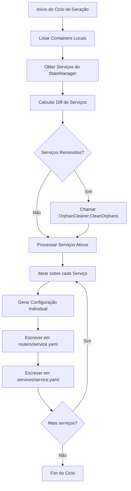

# Plano de Mudança: Geração de Configurações Multi-Arquivo

Este documento descreve a estratégia para alterar a arquitetura de geração de arquivos de configuração do Traefik, migrando de um único arquivo consolidado para múltiplos arquivos granulares por serviço.

## 1. Motivação
Atualmente, o Agente gera dois arquivos YAML globais (`routers.yaml` e `services.yaml`) contendo as configurações de todos os serviços detectados. Isso dificulta o debug manual e pode causar problemas de performance em clusters com centenas de serviços, além de tornar a limpeza de órfãos mais complexa (atualmente ela regera o arquivo todo).

## 2. Nova Estrutura de Arquivos
As configurações serão organizadas em subdiretórios dentro do diretório de configuração do Agente (`configDir`):

- `<configDir>/routers/<service-name>.yaml`: Contém a definição do router HTTP do serviço.
- `<configDir>/services/<service-name>.yaml`: Contém a definição do service (load balancer) do serviço.
- `<configDir>/middlewares.yaml`: Mantido como global para middlewares compartilhados (opcionalmente pode ser granularizado no futuro).

### Estratégia de Nomenclatura
- Utilizaremos o **nome do serviço** (`service-name`) como nome do arquivo.
- O nome do serviço é estável no ciclo de vida da stack/swarm, ao contrário do ID do container que muda a cada deploy.
- Exemplo: `my-web-app.yaml`.

## 3. Mudanças nos Componentes

### 3.1. Agent (`internal/agent/agent.go`)
- **Refatorar `generateLocalConfigs`**:
    - Remover o uso de `generator.MergeConfigs`.
    - Iterar sobre a lista de serviços ativos.
    - Para cada serviço, gerar sua configuração e escrever nos caminhos individuais usando o `AtomicWriter`.
    - Implementar a detecção de remoção de serviços utilizando o `DiffEngine`.
    - Chamar `orphanCleaner.CleanOrphans(diff.Removed)` para deletar arquivos de serviços que não estão mais presentes no estado.

### 3.2. Generator (`internal/config/generator.go`)
- Os métodos de geração (`GenerateLocalConfig`, `GenerateFederationRouterConfig`, etc.) já retornam objetos individuais, portanto não exigem mudanças estruturais profundas.
- O método `MergeConfigs` será mantido mas deixará de ser o fluxo principal do Agente.

### 3.3. OrphanCleaner (`internal/agent/orphan_cleaner.go`)
- O componente já está preparado para a estrutura de subpastas `routers/` e `services/`.
- Precisamos garantir que ele seja acionado corretamente pelo Agente.

## 4. Estratégia de Migração e Limpeza
Para evitar que configurações antigas (do modelo consolidado) entrem em conflito com as novas configurações granulares:

1. Na primeira execução com a nova arquitetura, o Agente deve verificar a existência de `routers.yaml` e `services.yaml` na raiz do `configDir`.
2. Se existirem, eles devem ser removidos.
3. O Traefik deve ser configurado para ler o diretório de forma recursiva:
   ```yaml
   providers:
     file:
       directory: /etc/traefik/conf.d
       watch: true
   ```

## 5. Fluxo de Trabalho (Mermaid)



## 6. Próximos Passos
1. Modificar `internal/agent/agent.go` para implementar a nova lógica de iteração e escrita.
2. Adicionar lógica de limpeza dos arquivos globais legados.
3. Atualizar testes unitários e de integração para validar a criação de múltiplos arquivos.
